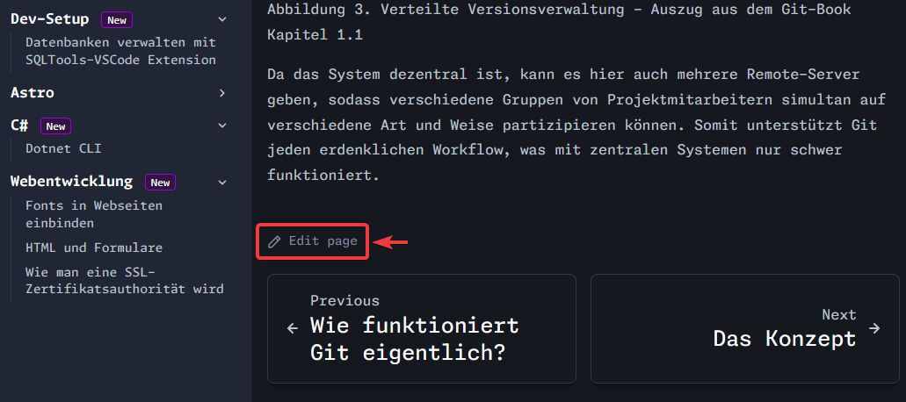
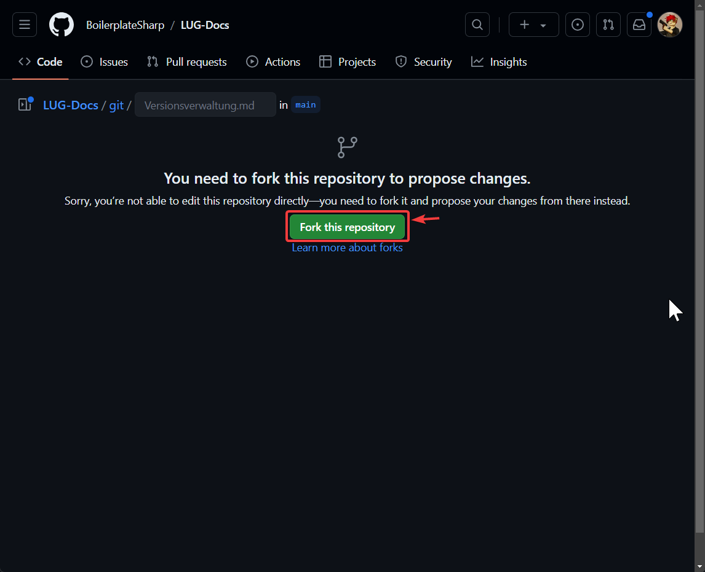
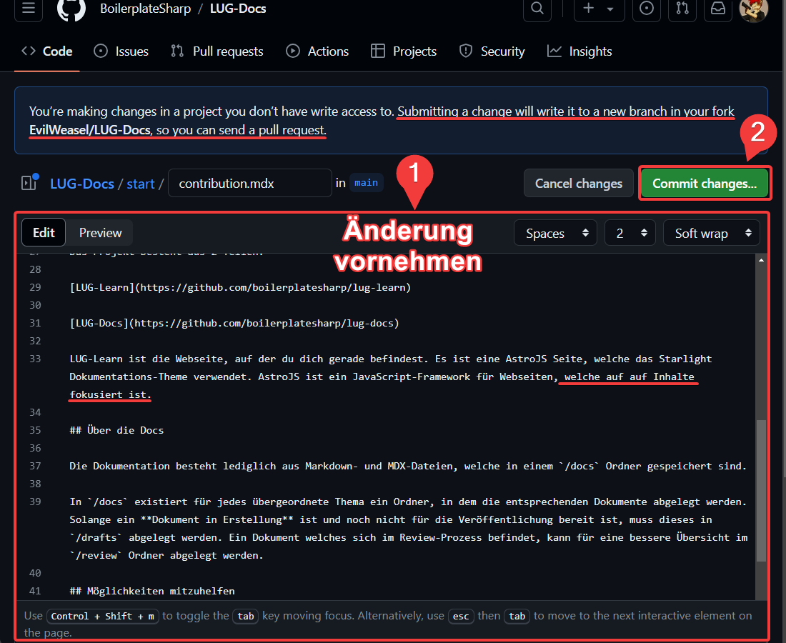
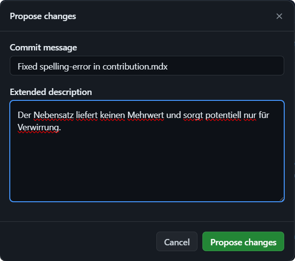
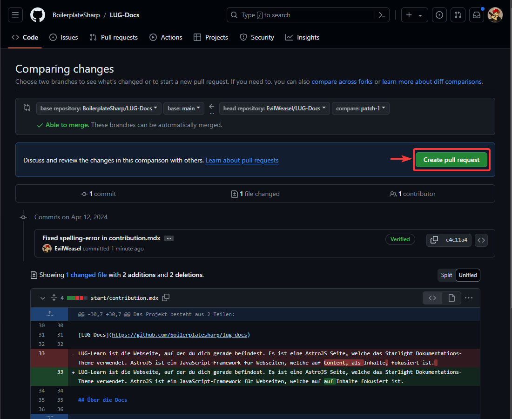
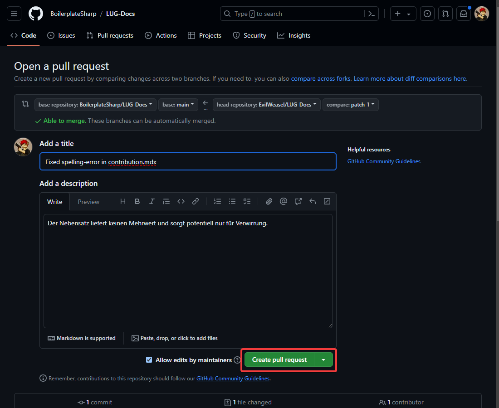

Du hast dich dafür entschieden bei diesem Projekt mitzuhelfen! Danke dafür! 💪

:::note

Falls du es noch nicht getan hast, solltest du unserem
[Discord Server](https://discord.gg/NzHk4m7d5w) beitreten. Dort kannst du Fragen
zu den hier dargestellten Themen beantwortet bekommen, Themen- oder
Verbesserungsvorschläge einbringen oder dich mit gleichgesinnten austauschen.

:::

## Die Vision

Das Ziel dieses Projekts ist es, ein Dokumentationssystem zu schaffen, das:

- **Einfach und Verständlich** für alle ist.
- Jedem **unmittelbar** und direkt **zugänglich** ist.
- **Sinnvolle Standards** durchsetzt.
- Ohne großen Aufwand **erweiterbar** ist.

Das _Ziel ist nicht, die perfekten Unterlagen zum Lernen anzubieten_. Vielmehr
sollen mit diesem System Unterlagen in einem iterativen Prozess erstellt werden.
Etwas haben ist meist besser, als nichts zu haben. Durch die **offene Natur**
dieses Projekts, und den **verschiedenen Mitwirkungsmöglichkeiten**, sollen
mithilfe der **Community** diese Dokumente konstant verbessert werden.

## Projektübersicht

import { LinkCard, CardGrid } from "@astrojs/starlight/components";

<CardGrid>
  <LinkCard
    title="Evil-Learn"
    href="https://github.com/evilweasel/docs"
    target="_blank"
  />
</CardGrid>

Evil-Learn ist die Webseite, auf der du dich gerade befindest. Es ist eine
AstroJS Seite, welche das Starlight Dokumentations-Theme verwendet. AstroJS ist
ein JavaScript-Framework für Webseiten, welche auf Content, als Inhalte,
fokusiert ist.

## Über die Docs

Die Dokumentation besteht lediglich aus Markdown- und MDX-Dateien, welche in
einem `/docs` Ordner gespeichert sind.

In `/docs` existiert für jedes übergeordnete Thema ein Ordner, in dem die
entsprechenden Dokumente abgelegt werden. Solange ein **Dokument in Erstellung**
ist und noch nicht für die Veröffentlichung bereit ist, kann dieses in `/drafts`
abgelegt werden. Solange die Seite Format-Fehler beinhaltet, sollte der
Dateiname mit einem Underscore `_` gepräfixt werden.

Ein Dokument welches sich im Review-Prozess befindet, kann für eine bessere
Übersicht im `/review` Ordner abgelegt werden.

## Vorschläge diskutieren

Unter dem **Discord Channel `Themenvorschläge`** kannst du Vorschläge für neue
Themenbereiche, einzelne Unterthemen oder kurzen Help-Artikeln einreichen und
die der anderen Diskutieren.

Wenn der Vorschlag gut in unser Konzept passt und sich ein **Contributor**
findet, welcher sich in dem Thema entsprechend auskennt oder sich dem Thema
annehmen möchte, wird ein entsprechendes **Issue auf Github** erstellt. Darunter
finden dann alle weiteren Diskussionen bezüglich des Themas statt.

## Fehler melden

Alle Dokumente auf dieser Seite befinden sich in einem öffentlichen Github
Repository. Dort kann jeder mit einem Github Account ein **Issue** aufmachen.
Ein Issue ist wie ein Ticket, wie es im Tech-Support oft funktioniert. Es ist
eine Problembeschreibung (oder Feature-Request), das aber jeder auf dem
Repository einsehen kann. Die Idee, Ursprünglich aus der Open-Source Software
Entwicklung, ist, dass sich so jeder an der Entwicklung, ohne große Mühen,
beteiligen kann.

todo: guide issue erstellen

## Fehler beheben

:::note[Lokal Arbeiten]

Du bist Entwickler und möchtest mit einer lokalen Version des Repositories,
inklusive lokaler Website als Preview, arbeiten? Klicke [hier](#für-entwickler).

Du bist kein Entwickler, aber kennst dich halbwegs mit Git aus? Du möchtest mit
einer lokalen Version der Docs arbeiten? Klicke [hier](#lokale-docs).

**Du hast keinen Plan von Git und Github, möchtest aber trotzdem mithelfen. Dann
lies einfach weiter.**

:::

Du hast bei Lesen eines Dokuments einen Fehler gefunden und 5 Minuten Zeit?
Klicke dafür einfach auf den `Edit page` Link am Ende eines jeden Dokuments auf
der Seite.



Falls es das erste Mal ist, dass du eine Verbesserung vornimmst, wirst du auf
folgende Seite weitergeleitet:



Dort musst du auf den grünen Fork-Button klicken, worauf dir Github eine eigene
Kopie des Repos erstellt unter `<username>/LUG-Docs`. Dort kannst du die Seite
im Markdown-Format einfach bearbeiten und die Änderungen, mit "Commit changes",
speichern.



Um die Änderungen dann im originalen Repository zu übernehmen, musst du einen
Pull-Request einreichen. Sobald du auf _"Commit changes"_ geklickt hast,
bekommst du die Möglichkeit eine **kurze "Commit message"** und **eine
Beschreibung deiner Änderungen** anzugeben. Halte dich _kurz und aber
spezifisch_, und erstelle den Pull-Request mit **"Propose changes"**.



Nach dem Klick auf den grünen Button, wirst du auf die Seite des LUG-Docs
Repositories weitergeleitet, wo du den Pull-Request einreichen kannst. Dort wird
dir zur Überprüfung deine Änderungen nochmals angezeigt.

Bist du zufrieden mit deinen Änderungen, dann klicke wieder auf den grünen
Button.



Das wars schon fast. Nun bekommst du ein letztes Mal die Möglichkeit deine
"Commit message" und Beschreibung der Änderungen anzupassen. Klicke hier einfach
wieder auf den grünen "Create Pull-Request" Button, dann hast du es geschafft.



Das wars. Nun ist der Pull-Request eingereicht und du wirst auf die
Diskussions-Seite des Pull-Requests weitergeleitet. Hier kann die Änderung mit
anderen Mitwirkenden am Projekt besprochen, und gegebenenfalls nochmal
überarbeitet werden.

### Für Entwickler

Wenn du dich halbwegs mit Git und Github auskennst, ist die Beste Möglichkeit
mitzumachen, an einer lokalen Kopie von LUG-Learn, zusammen mit deiner Fork des
Docs-Repositories zu arbeiten.

:::tip

Neben Git, muss mit dieser Variante ebenfalls **NodeJS** auf deinem System
installiert sein, damit der Dev-Server, für die Preview der Seite, angezeigt
werden kann.

:::

Hier die Schritte:

import { Steps } from "@astrojs/starlight/components";

<Steps>

1. Clone das Website-Projekt LUG-Learn mit dem folgenden Befehl, um auch das
   Docs-Submodul zu laden:
   ```shell title="cloning repository..."
   git clone --recurse-submodules https://github.com/BoilerplateSharp/LUG-Learn.git
   cd ./LUG-Learn
   ```
2. Installiere die Abhängigkeiten für die Website für die lokale Preview:
   ```shell title="installing dependencies..."
   npm install
   ```
3. Starte den Entwicklungs-Server und öffne die Seite in einem Webbrowser deiner
   Wahl unter `localhost:4321/`
   ```shell title="starting dev-server"
   npm run start
   ```
4. Starte [Obsidian.md](https://obsidian.md) oder einen anderen Markdown-Editor
   deiner Wahl und öffne den `src/content/docs/` Unterordner. Der Rest der
   Webseite ist für die Dokumente nicht relevant.

</Steps>

Um Änderungen einzureichen, musst du diese auf eine eigene Fork des LUG-Docs
Repositories hochladen.

<Steps>

1. Forke das Docs-Repository auf Github.
2. In deinem lokalen Docs-Ordner unter `src/content/docs`, ändere die Remote-URL
   auf deine Fork um:
   ```shell title="switching remote..."
   git remote set-url origin "UrlZuDeinerFork"
   ```
3. Füge, wie in Git üblich, deine Änderungen hinzu, schreibe eine neue Version
   und lade deine Änderungen auf deine Fork hoch:
   ```shell title="pushing changes..."
   git add .
   git commit -m "Added some changes"
   git push
   ```

</Steps>

Wenn deine Änderungen auf Github hochgeladen sind, kannst du einen Pull-Request
im LUG-Docs Repository anlegen.

### Lokale Docs

**Du bist kein Entwickler**, möchtest aber trotzdem eine lokale Version auf
deinem PC haben und mit einem Editor deiner Wahl mitarbeiten? Dann musst du auf
Github einen Fork des Repositories erstellen. Falls Forks für dich Neuland sind,
findest du
[hier](https://docs.github.com/de/pull-requests/collaborating-with-pull-requests/working-with-forks/fork-a-repo)
nähere Informationen und eine kleine Übung dazu.

:::tip

Für diese Variante des Mitwirkens, musst du Git und einen Markdown-Editor (z.B.
`Obsidian.md`) installiert haben.

<CardGrid>
  <LinkCard title="Git Download" href="https://git-scm.com" target="_blank" />
  <LinkCard
    title="Obsidian Download"
    href="https://obsidian.md"
    target="_blank"
  />
</CardGrid>

:::

Nachdem du deine Fork des Projekts erstellt hast, klone dieses Repository auf
deinen PC und öffne den Ordner mit einem Markdown-Editor deiner Wahl.

[Obsidian.md](https://obsidian.md) ist ein Markdown-Editor, welcher eine
Vielzahl von Plugins und Themes anbietet. Außerdem erleichtert er mit
eingebauter Vorschau des Dokuments, wie es im Browser aussehen wird, eine
einfache und nahtlose Writing-Experience.

In dem Repository befindet sich ein `.obsidian` Ordner. Diesen Ordner musst du
nicht direkt bearbeiten, er enthält aber eine Konfiguration mit sinnvollen
Defaults. Du kannst über das ⚙️Settings-UI alle Einstellungen anpassen, wie es
für dich am Besten passt.
