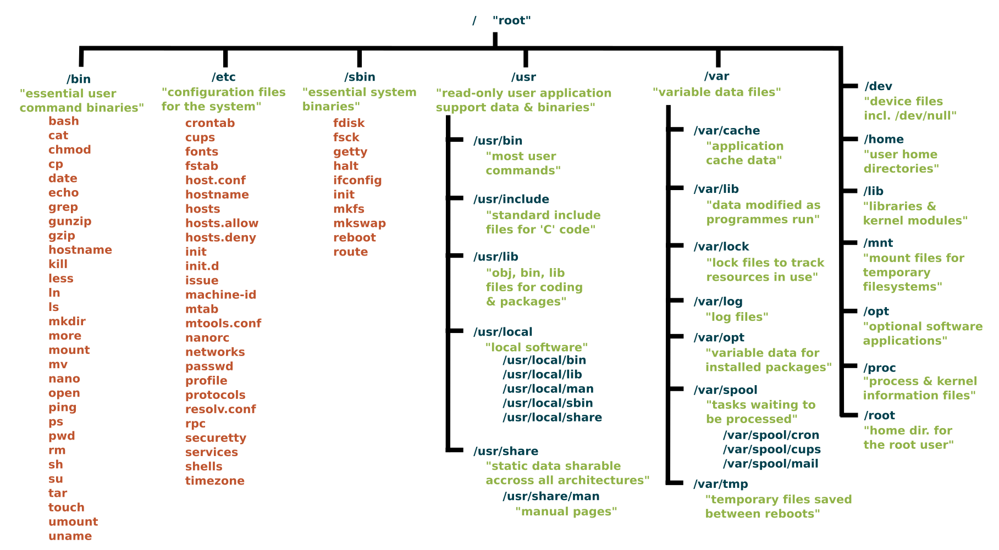

In Windows sind auf dem obersten Level des Dateisystems die "Festplatten" wie `C:\`, `D:\` und so weiter.

In Linux gibt es ein Dateisystem, das mit `/` anfängt. Das ist quasi wie die `C:\` Festplatte in Windows. Wenn wir in Linux mehr Speicher brauchen, dann partitionieren wir Festplatten und **Mounten** diese in einem Ordner, üblicherweise in `/mnt`. Mehr dazu später.

import { FileTree } from "@astrojs/starlight/components";

<FileTree>
- bin/ Binaries; Executables; Programme; z.B. `ls`
- boot/ Boot-Files; Nichts verändern!
- dev/ Device-Files; Treiber; Festplatten; USB;
- etc/ Et cetera; Config-Files; Konfiguration;
- home/ User-Directory; `C:\Users`
- init
- lib/ Libraries; Bibliotheken; Kernel-Module (z.B. WiFi, Printer)
- lib64/ 64-Bit Libraries
- lost+found/
- media/ Auto-Mount external storage; USB-Mount-Point
- mnt/ Mount; zusätzliche Festplatten werden hier gemountet
- opt/ Optional-Software
  - bin/ Optionale Binaries
  - lib/ Optionale Bibliotheken
- proc/ Prozesse; Systeminformationen
- root/ Root-User Home-Directory
- run/ Temp-Files für Programme
- sbin/ System-Binaries; Systemprogramme
- srv/ Server; Web- oder FTP-Server Dateien;
- sys/ System-Informationen; ähnlich wie `/proc`
- tmp/ Temporary-Files;
- usr/ User-Related Files; globale Programme für alle User (z.B. Browsers, Word-Prozessoren)
  - bin/
  - sbin/
  - lib/
- var/ Variable-Files
  - log/ System-Logs
</FileTree>

## Befehle für Interaktion mit dem Dateisystem

### Basics

| Befehl               | Aktion                                                             |
| -------------------- | ------------------------------------------------------------------ |
| `ls`                 | Listet alle Dateien und Ordner im aktuellen Ordner auf             |
| `cp <quelle> <ziel>` | Kopiere Datei oder Ordner                                          |
| `mv <quelle> <ziel>` | Verschiebt Datei oder Ordner                                       |
| `touch`              | Erstellt eine neue Datei                                           |
| `mkdir`              | Erstellt einen neuen Ordner                                        |
| `rm`                 | Löscht eine Datei                                                  |
| `rmdir`              | Löscht einen Ordner                                                |
| `rm -rf`             | Löscht einen Ordner rekursiv (inkl. aller Dateien und Unterordner) |

### Advanced

| Befehl  | Aktion                                                                      |
| ------- | --------------------------------------------------------------------------- |
| `chmod` | Ändert die Berechtigungen einer Datei oder eines Verzeichnisses             |
| `chown` | Ändert den Besitzer einer Datei oder eines Verzeichnisses                   |
| `grep`  | Durchsucht den Inhalt von Dateien nach einem bestimmten Muster              |
| `find`  | Sucht nach Dateien und Verzeichnissen basierend auf verschiedenen Kriterien |
| `cat`   | Zeigt den Inhalt einer Datei an oder verbindet mehrere Dateien              |
| `head`  | Zeigt die ersten Zeilen einer Datei an                                      |
| `tail`  | Zeigt die letzten Zeilen einer Datei an                                     |
| `diff`  | Vergleicht den Inhalt von zwei Dateien und zeigt die Unterschiede an        |
| `tar`   | Packt Dateien und Verzeichnisse in ein Archiv zusammen                      |

## Home-Verzeichnis

Das User Homeverzeichnis ist, wie unter Windows `C:\Users`, das Verzeichnis, wo wir als normaler Benutzer alle Berechtigungen haben. Dort können wir ohne Administrator-Berechtigungen Änderungen vornehmen. Unter verschiedenen Linux-Distributionen werden hier unterschiedliche Dateien und Konfigurationen gespeichert. Die wohl wichtigsten Ordner hier sind der `.config` und der `.ssh` Ordner. Unter `.config` werden Konfigurationsdateien verschiedener User-Anwendungen (z.B. neovim) gespeichert.

## Berechtigungen

In Linux haben Dateien und Verzeichnisse Berechtigungen, die bestimmen, wer auf sie zugreifen, sie lesen, schreiben oder ausführen kann. Diese Berechtigungen sind wichtig für die Sicherheit und den Schutz von Daten und Systemressourcen.

Die Berechtigungen für die Dateien im aktuellen Ordner können wir in der Listen-Ansicht von `ls` sehen:

```shell
ls -lah
total 44K
drwx------  2 evilweasel evilweasel 4.0K Mar 11 22:27 .
drwx------ 23 evilweasel evilweasel 4.0K Apr  9 13:17 ..
-rw-------  1 evilweasel evilweasel  464 Jan 31 11:14 ToasterDev
-rw-r--r--  1 evilweasel evilweasel  100 Jan 31 11:14 ToasterDev.pub
-rw-r--r--  1 evilweasel evilweasel  480 Mar  3 22:51 config
-rw-------  1 evilweasel evilweasel  828 Mar 11 22:27 known_hosts
```

### Symbolisch

Die Berechtigungen können unter anderem symbolisch dargestellt werden und bestehen aus drei Gruppen: Besitzer (**owner**), Gruppe (**group**) und Andere (**others**).

- **u:** Steht für den Besitzer (user) der Datei oder des Verzeichnisses.
- **g:** Steht für die Gruppe (group), der die Datei oder das Verzeichnis gehört.
- **o:** Steht für "andere" (others), alle anderen Benutzer außer dem Besitzer und der Gruppe.
- **a:** Steht für "alle" (all), was eine Kombination von `ugo` ist und alle Benutzergruppen umfasst.

Jede Gruppe hat verschiedene Rechte, die durch Buchstaben dargestellt werden.

- **r (read):** Leserechte
- **w (write):** Schreibrechte
- **x (execute):** Ausführungsrechte

Die Symbole für die Berechtigungen sind:

- **+:** Fügt die angegebene Berechtigung hinzu.
- **-:** Entfernt die angegebene Berechtigung.
- **=:** Setzt die Berechtigung auf genau die angegebene.

So können wir die Berechtigungen einer Datei mit dem `chmod` Command ändern:

```shell
sudo chmod u=rwx,g=rx,o=x Datei.txt
sudo chmod a+x script.sh
```

### Oktal

Neben der Symbolischen Variante, können wir ebenfalls einen kleinen Trick nutzen, um noch spezifischer bei der Vergabe von Rechten zu sein. Dazu müssen wir 2 Sachen im Kopf behalten:

- Bei Berechtigungen gilt: Erlaub/Verboten; Ja/Nein; `true`/`false`
- Es gibt 3 Berechtigungen, die gesetzt sein können:
  - **r (read):** Leserechte
  - **w (write):** Schreibrechte
  - **x (execute):** Ausführungsrechte

In der Oktalvariante ordnen wir jeder Berechtigung einen Wert zu:

- **r:** 4
- **w:** 2
- **x:** 1

Wenn wir diese Zahlen kombinieren, können wir die Berechtigungen für alle 3 Berechtigungsgruppen (Owner, Group und Others) mit jeweils einem Wert angeben.

```shell
sudo chmod 751 Datei1 # u=rwx,g=rx,o=x
sudo chmod 744 Datei1 # u=rwx,g=r,o=r
sudo chmod 700 Datei1 # u=rwx,g-rwx,o-rwx
```

### Besitzer ändern

Den Besitzer einer Datei änderst du mit dem `chown` Commmand.

```bash
sudo chown tobi ./Datei1
sudo chown -R tobi ./Ordner
```

### Gruppe ändern

Ebenfalls lässt sich mit dem gleichen Command `chown` auch die Gruppe ändern.

```bash
sudo chown :ftp_user ./Datei1 # Ändert nur die Gruppe
sudo chown tobi:ftp_user ./Ordner # Ändert Gruppe und Owner in einem Schritt
```

## Links

In Linux gibt es zwei Arten von Verknüpfungen für Dateien: **Softlinks** (symbolische Links) und **Hardlinks**. Diese ermöglichen es, auf eine Datei oder ein Verzeichnis von mehreren Stellen im Dateisystem aus zuzugreifen, ohne die Datei mehrmals zu speichern. 

#### Softlinks (symbolische Links)

Ein Softlink ist eine spezielle Datei, die **auf eine andere Datei oder ein Verzeichnis verweist**. Es handelt sich um eine *indirekte Referenz auf die Zielressource*. Wenn das Ziel eines Softlinks gelöscht wird, bleibt die Softlink-Datei erhalten, aber der Zugriff darauf führt ins Leere.

##### Erstellung eines Softlinks

Der Syntax für das Erstellen eines Softlinks lautet:

```shell
ln -s <ziel> <link>
```

:::note[Wichtig!]

Zuerst wird das Ziel der Verlinkung (wo man rauskommen möchte) angegeben! Dann erst kommt der Pfad, wo der Link erstellt werden soll. 

:::

Beispiel:
```shell
ln -s ziel/ ./link # Erstellt den Link
ls -lah # Zeigt den Link an
total 12K
drwxr-xr-x  3 evilweasel evilweasel 4.0K Apr  9 13:12 .
drwx------ 23 evilweasel evilweasel 4.0K Apr  9 11:12 ..
lrwxrwxrwx  1 evilweasel evilweasel    5 Apr  9 13:12 link -> ziel/
drwxr-xr-x  2 evilweasel evilweasel 4.0K Apr  9 13:11 ziel
```

#### Hardlinks

Ein Hardlink ist eine weitere Verknüpfung auf die tatsächliche Datei oder das Verzeichnis im Dateisystem. Es handelt sich um eine **direkte Referenz auf die Speicheradresse der Datei**. Wenn das Original gelöscht wird, bleiben Hardlinks erhalten und verweisen weiterhin auf die Daten. Ein **Hardlink kann nicht auf ein Verzeichnis** erstellt werden und kann *nicht zwischen verschiedenen Dateisystemen* erstellt werden.

##### Erstellung eines Hardlinks

Der Syntax für das Erstellen eines Hardlinks lautet:

```shell
ln <ziel> <link>
```

Beispiel:
```shell
ln ziel/readme.md link
ls -lah
total 12K
drwxr-xr-x 3 evilweasel evilweasel 4.0K Apr  9 13:17 .
drwxr-xr-x 4 evilweasel evilweasel 4.0K Apr  9 13:17 ..
-rw-r--r-- 2 evilweasel evilweasel    0 Apr  9 13:17 link
drwxr-xr-x 2 evilweasel evilweasel 4.0K Apr  9 13:17 ziel
```

`link` sieht hier zwar aus wie eine eigenständige Datei, aber genau das ist der Zweck eines Hardlinks. Wenn wir link bearbeiten, ändert sich auch der Inhalt von `ziel/readme.md`.

#### Verwendung in Windows PowerShell

In Windows PowerShell können Softlinks (symbolische Links) mit dem `New-Item` Cmdlet und dem `-ItemType SymbolicLink` Parameter erstellt werden.

```powershell
New-Item -ItemType SymbolicLink -Path "Ziel" -Name "Link"
```

Hardlinks werden in Windows PowerShell nicht direkt unterstützt, da sie eine Eigenschaft des Dateisystems sind und NTFS (das Dateisystem von Windows) keine Hardlinks für Verzeichnisse unterstützt.

Diese Verknüpfungen sind nützliche Werkzeuge für die Organisation von Dateien und Verzeichnissen in Linux und können die Verwaltung von Ressourcen vereinfachen.

## Partitionen

Partitionen sind Unterteilungen einer physischen Festplatte, die es ermöglichen, den Speicherplatz effizient zu organisieren und zu verwalten. In Linux werden Partitionen oft genutzt, um verschiedene Betriebssysteme zu installieren, Daten zu speichern oder das System und Benutzerdaten zu trennen.

### Partitionstypen

Es gibt verschiedene Arten von Partitionen, die unterschiedliche Zwecke erfüllen:

- **Primäre Partitionen:** Dies sind eigenständige Partitionen, die direkt auf der Festplatte erstellt werden können. Ein MBR (Master Boot Record) unterstützt bis zu vier primäre Partitionen oder drei primäre Partitionen und eine erweiterte Partition. Bei GPT sind bis zu 128 Partitionen möglich.
- **Erweiterte Partitionen:** Diese dienen als Container für logische Laufwerke. Mit einer erweiterten Partition können mehr als vier Partitionen auf einer Festplatte erstellt werden.
- **Logische Laufwerke:** Diese werden innerhalb einer erweiterten Partition erstellt und verhalten sich wie eigenständige Partitionen.

### Partitionierungswerkzeuge

Linux bietet verschiedene Werkzeuge für die Partitionierung von Festplatten:

- **fdisk:** Ein interaktives Kommandozeilen-Werkzeug zur Partitionierung von Festplatten.
- **parted:** Ein weiteres Befehlszeilenprogramm zur Partitionierung von Festplatten.
- **gparted:** Eine grafische Benutzeroberfläche für parted, die eine benutzerfreundliche Möglichkeit zur Partitionierung von Festplatten bietet.

## Partitionen Erstellen

Hier die Partitionierung einer 50GB Festplatte in `2x25GB` Partitionen mit `fdisk`. Die Festplatte in diesem Beispiel ist `/dev/sdb`.

todo: video

## Filesystem auf Partition schreiben

Um ein Dateisystem auf eine Partition zu schreiben und diese damit nutzbar zu machen, nutzen wir `mkfs -t` mit dem jeweiligen Dateisystem, welches wir nutzen wollen.

```bash
sudo mkfs -t ext4 /dev/sdb1
```

## Mounten von Partitionen

Nachdem eine Partition erstellt wurde, muss sie eingehängt (gemountet) werden, damit das Dateisystem darauf zugreifen kann. Dazu wird ein Einhängepunkt (Mount Point) im Linux-Dateisystem erstellt, üblicherweise unter `/mnt` oder `/media`.

**Manuelles Mounten:** Der `mount` Befehl erwartet den Dateisystemtyp und den Pfad zur Partition.

```shell
mount -t ext4 /dev/sda1 /mnt/mydisk
```

**Automatisches Mounten:** Dies wird in der Datei `/etc/fstab` konfiguriert, um beim Systemstart automatisch zu mounten.

```shell
/dev/sda1   /mnt/mydisk   ext4    defaults    0   2
```

## Im Detail


