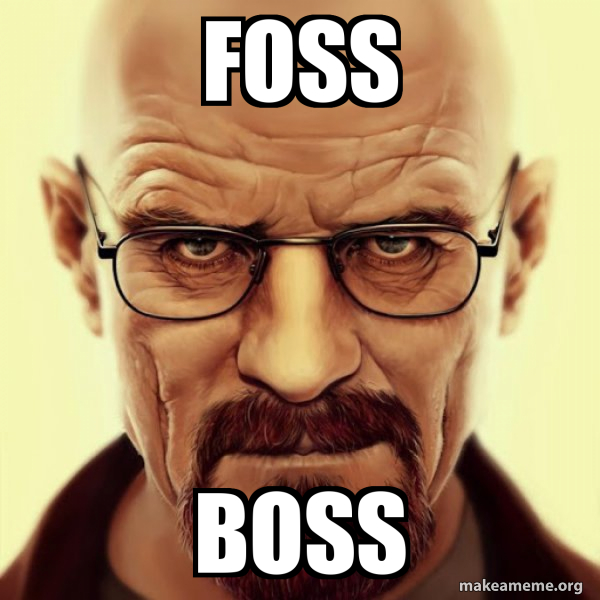

## Bescheidene Anfänge🕛

Wir schreiben das Jahr 1991. Ein 21 Jähriger Student aus Hellsinki postete folgende Nachricht in der Usenet-Newsgroup `comp.os.minix`

> Hello everybody out there using minix -
> 
> I’m doing a (free) operating system (just a hobby, won’t be big and professional like gnu)…

Nur ein Hobby… Das zumindest war das der Plan, welchen der 21 Jährige Linus Torvalds zu diesem Zeitpunkt hatte.

Heute benutzen aufwärts von 90% aller Server eine der vielen Linux-Varianten und das Linux-Projekt wird heute als eines der wichtigsten Softwareprojekte auf der ganzen Welt angesehen. Aber warum eigentlich?

## Moneten 💵

Zuerst wurde Linux mit einer proprietären Lizenz veröffentlicht. Nach einigen Monaten hat sich Linus dann entschieden, eine Änderung der Lizenz anzukündigen. Seither ist Linux unter der [GNU GPL](https://de.wikipedia.org/wiki/GNU_General_Public_License) für alle kostenlos für alle verfügbar, nicht nur zur freien Nutzung, sondern auch zur Veränderung und Erstellung von Derivaten des Systems. 

In Kurz: Linux ist 1992 kostenlos zu nutzen und kann ohne Erwerb einer kostspieligen Lizenz kommerziell genutzt werden.

> Software is like sex…
> It’s better, when it’s free
> - Linus Torvalds

## Offene Quelle 🔓

Der Source-Code von Linux ist offen. Das bedeutet, dass jeder sich den Quellcode anschauen kann, diesen runterladen und sogar verändern und veröffentlichen kann. Dies sorgte dafür, dass Entwickler auf der ganzen Welt, aber erstmal hauptsächlich diese, welche gegen Microsoft waren, sich auf dieses neue System stürzten und fleißig mitentwickelten. In einem Interview äußerte sich Linus Torvalds später zu seiner Entscheidung: 

> „Die Entscheidung, Linux unter die GPL zu stellen, war definitiv das Beste, was ich je getan habe.“
> 

## Party like it’s 1969 🕺

Kleiner Sprung zurück in der Zeit: Während die Meisten das Jahr 1969 wegen dem Höhepunkt der Hippyiebewegung in den USA kennen, erstellten 2 Nerds namens Dennis Ritchie und Ken Thompson ein neues Betriebssystem namens UNIX. Das Produkt wurde von vielen Akademikern der Zeit geliebt und sogar weiterentwickelt, jedoch gab es ein Problem.

In den 80ern wurde UNIX von AT&T, der Firma, wo die beiden damals arbeiteten, kommerzialisiert. 1977 wurde beispielsweise die Universität von Berkeley von AT&T für die nicht lizenzierte Nutzung von UNIX verklagt. Dies war der Start der sogenannten “Unix Wars”.  Aber dazu vielleicht an anderer Stelle mehr…

UNIX war, im übrigen, auch das erste Betriebssystem mit einem hierarchischem und baumartigen aufgebauten Dateisystem.

## Sue me, if you can! 😎

Im Jahr 1983 startete Richard Stallman das GNU Projekt, welches als kostenfreie und offene Alternative für UNIX dienen sollte. Allerdings startete Stallman nicht mit einem Kernel, sondern damit alle nennenswerten UNIX Standard-Programme durch seine eigenen Versionen zu ersetzen. Viele dieser Programme findet man noch auf den heutigen Linux Distributionen, wie z.B. `TAR`, `GREP`, `BASH` , `EMACS` und natürlich der unverzichtbare C-Compiler namens `GCC`. Diese Arbeit dauerte eine ganze Weile an, aber dann kamen die 2000er Jahre und es fehlte noch eine wichtige Komponente um das Projekt fertigzustellen….

Im Übrigen ist der Name "GNU" ein rekursives Akronym für "GNU's Not Unix".

## Polymerisation 🫶

Das Herzstück eines jeden Betriebssystems fehlte für das GNU Projekt. Der OS-Kernel. Aber was ist ein Kernel eigentlich und welche Aufgaben hat dieser?

Einfach Formuliert, stellt er eine Brücke zwischen den Anwendungen und der tatsächlichen Datenverarbeitung auf der Hardwareebene dar. Der Kernel ist verantwortlich für grundlegende Funktionen wie Speicherverwaltung, Prozessverwaltung, Geräteverwaltung und Dateisystemverwaltung. So ein System ist also sehr komplex und nicht einfach zu schreiben. Gut, dass ein anderer, jüngerer aber genauso Software-Patriotischer Entwickler zu dieser Zeit an einem Kernel arbeitete, der rein Zufällig ebenfalls recht UNIX-Artig ist.

Nach der Veröffentlichung des Linux Kernels, haben einige Entwickler angefangen, den Linux-Kernel mit der Softwarebibliothek von GNU zu kombinieren. Heraus kamen die ersten Linux-Distributionen, welche heute als **GNU/Linux** bezeichnet werden. Hier ein paar Namen zu diesen Kindern:

- Slackware
- Softlanding
- Debian 😍

# Takeaways:

- Linux wurde ursprünglich als Hobbyprojekt von Linus Torvalds im Jahr 1991 erstellt.
- Linux ist unter der GNU GPL-Lizenz erhältlich, die eine kostenlose Nutzung und Modifikation des Systems ermöglicht.
- Die Open-Source-Natur von Linux hat eine weitreichende Entwicklung und Zusammenarbeit von Entwicklern auf der ganzen Welt ermöglicht.
- Linux wurde mit der GNU-Softwarebibliothek kombiniert, um die ersten Linux-Distributionen zu erstellen, bekannt als GNU/Linux.
- Der Kernel ist eine entscheidende Komponente eines Betriebssystems, die für grundlegende Funktionen wie Prozess-, Speicher- und Geräteverwaltung verantwortlich ist.
- Das UNIX-Betriebssystem war eine wesentliche Inspiration für Linux, und viele der Standard-UNIX-Programme wurden durch GNU-Äquivalente ersetzt.
- Die Geschichte von UNIX und den UNIX-Kriegen spielte eine bedeutende Rolle in der Entwicklung von Linux.
