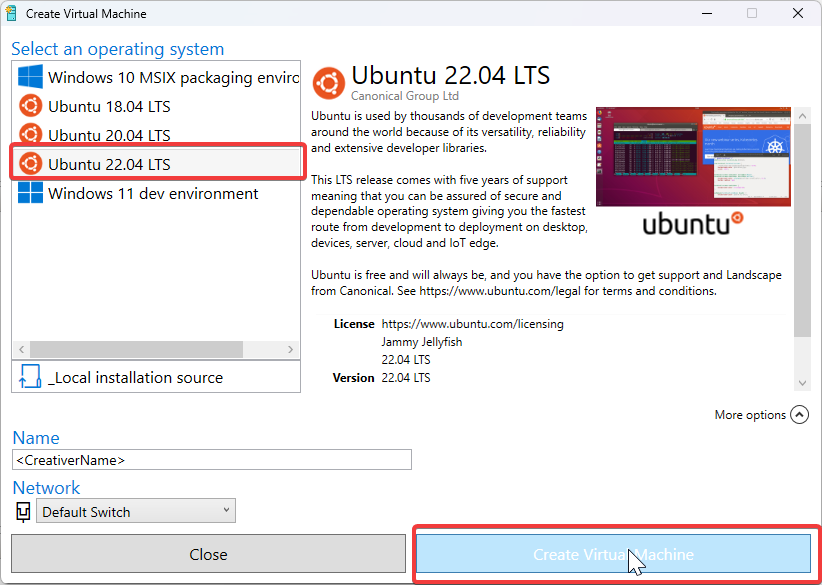

## Einleitung

Um auf dem eigenen Windows PC ein Linux Betriebssystem zu installieren gibt es mehrere Möglichkeiten. In diesem Artikel wird der Weg über Microsoft HyperV erläutert. Die beste Methode jedoch, zumindest für die meisten Anwendungsfälle, ist die Installation über WSL. Mehr dazu hier: [Installation von Linux über WSL](/linux/linux-install-wsl)

## Hinweis für Firmenlaptops

Die Installation mit HyperV setzt, im übrigen [wie die mit WSL](/linux/linux-install-wsl/), voraus, dass man Administratorberechtigungen auf dem Computer benötigt. Diese werden lediglich für die Einrichtung des Systems benötigt und sollte beim Einsatz von Firmenlaptops/-Computern mit dem zuständigen Administrator abgesprochen werden.

## Installation

Um mit Hyper-V eine virtuelle Linux-Machine zu erstellen, gibt es 2 Wege:

### Quick Create

### New (manuell)

## Zusätzliche Ressourcen und Quellen

import { LinkCard, CardGrid } from '@astrojs/starlight/components';

<CardGrid>
  <LinkCard title="Bewährte Methoden für die Ausführung von Linux auf Hyper-V" href="https://learn.microsoft.com/de-de/windows-server/virtualization/hyper-v/best-practices-for-running-linux-on-hyper-v" target="_blank" />
  <LinkCard title="How to install Ubuntu 20.04 on Hyper-V with enhanced session" href="https://francescotonini.medium.com/how-to-install-ubuntu-20-04-on-hyper-v-with-enhanced-session-b20a269a5fa7" target="_blank" />
</CardGrid>
