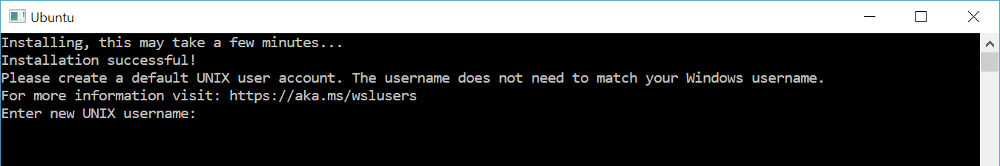

Das **Windows Subsystem für Linux (WSL)** ermöglicht es Entwicklern, eine Linux-Distribution (wie Ubuntu, OpenSUSE, Kali, Debian, Arch Linux usw.) zu installieren und Linux-Anwendungen, Dienstprogramme und Bash-Befehlszeilentools direkt auf Windows zu verwenden, unverändert und ohne den Overhead einer traditionellen virtuellen Maschine oder Dual-Boot-Setup.

## Hinweis für Firmenlaptops

Die Installation mit WSL setzt, im übrigen wie die [Installation von Linux über HyperV](/linux/linux-install-hyperv/) voraus, dass man Adminberechtigungen auf dem Computer hat. Diese werden lediglich für die Einrichtung des Systems benötigt und sollte beim Einsatz von Firmenlaptops/-Computern mit dem zuständigen Administrator abgesprochen werden.

## Installation von WSL

Um WSL zu installieren, musst du Windows 10 (Build 19041 und höher) oder Windows 11 verwenden. Du kannst alles, was du benötigst, um WSL zu nutzen, mit einem einfachen Command installieren. Öffne PowerShell oder Windows Command Prompt im Administrator-Modus, gebe den Befehl **`wsl --install`** ein und starte dann den Computer neu. Dieser Befehl aktiviert die Funktionen, die zum Ausführen von WSL erforderlich sind, und installiert die Ubuntu-Distribution von Linux.

```powershell
wsl --install
```

## Windows 10: PSA

:::note
Für die Nutzung von WSL mit älteren Windows 10 Versionen sind geg. zusätzliche Schritte notwendig. Hier eine [Anleitung von Microsoft](https://learn.microsoft.com/de-de/windows/wsl/install-manual).
:::

Zusätzlich sollte danach noch die WSL Version auf WSL2 gestellt werden.

## Erste Schritte

> Wenn du eine neu installierte Linux-Verteilung zum ersten Mal startest, wird ein Konsolenfenster geöffnet, und du wirst aufgefordert, ein oder zwei Minuten zu warten, bis die Dateien dekomprimiert und auf dem PC gespeichert wurden. Alle zukünftigen Starts sollten selten mehr als eine Sekunde in Anspruch nehmen.
> 



## Verwaltung von Linux-Distributionen

Standardmäßig wird die installierte Linux-Distribution Ubuntu sein. Dies kann mit der **`-d`**-Flag geändert werden. Um die installierte Distribution zu ändern, gebe **`wsl --install -d <Distribution Name>`** ein. Ersetze **`<Distribution Name>`** durch den Namen der Distribution, die du installieren möchtest. Um eine Liste der verfügbaren Linux-Distributionen zu sehen, die zum Download über den Online-Store verfügbar sind, gebe **`wsl --list --online`** oder **`wsl -l -o`** ein.

## Zusätzliche Ressourcen und Quellen

import { LinkCard, CardGrid } from '@astrojs/starlight/components';

<CardGrid>
  <LinkCard title="Häufig gestellte Fragen zu Windows-Subsystem für Linux" href="https://learn.microsoft.com/de-de/windows/wsl/faq" target="_blank" />
  <LinkCard title="Problembehandlung des Windows-Subsystems für Linux" href="https://learn.microsoft.com/de-de/windows/wsl/troubleshooting" target="_blank" />
  <LinkCard title="Dateisystemübergreifendes Arbeiten" href="https://learn.microsoft.com/de-de/windows/wsl/filesystems" target="_blank" />
  <LinkCard title="Installieren von WSL" href="https://learn.microsoft.com/de-de/windows/wsl/install" target="_blank" />
  <LinkCard title="Ausführen von Linux-GUI-Apps mit WSL" href="https://learn.microsoft.com/de-de/windows/wsl/tutorials/gui-apps" target="_blank" />
</CardGrid>
