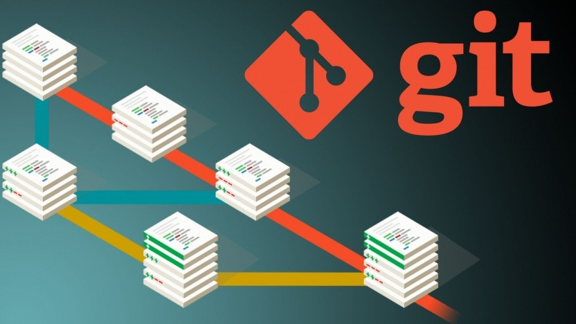
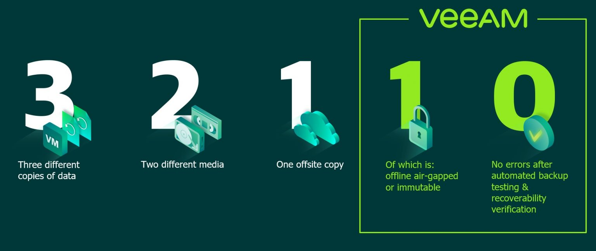
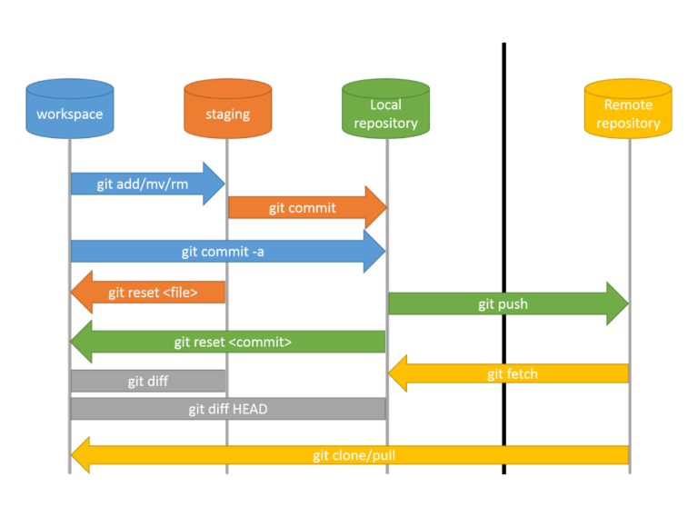

# Git für Anfänger

## *Versionieren mit Style*

---

## Agenda

- [Was ist Versionsverwaltung?](#Versionsverwaltung)
- [Warum Git?](#Warum%20Git?)
- [Wie nutze ich Git?](#Wie%20nutze%20ich%20Git?)
  - [Repo-Setup](#Repo-Setup)
  - [Änderungen verwalten](#Änderungen%20verwalten)
  - [Undo-Operationen](#Undo-Operationen)
- [Github und Collaboration](#Github%20und%20Collaboration)

---

## Versionsverwaltung


*Bild: [Git, Jason Long](https://git-scm.com/downloads/logos)/[CC-BY 3.0](http://creativecommons.org/licenses/by/3.0/)* <!-- element style="font-size: .5em;" -->

notes:
Einfach erklärt ist Versionsverwaltung ein System, welches Änderungen über Zeit protokolliert.
In unserem konkreten Fall sprechen wir von Versionsverwaltung in der Softwareentwicklung. Dabei kann man Versionsverwaltungssysteme für alle möglichen Dateien nutzen, auch wenn es in manchen Fällen nicht sonderlich sinnvoll ist.

---

### Rudimentäre Backups


*Bild: [Veeam - 3-2-1-Backup-Rules](https://www.veeam.com/blog/321-backup-rule.html)* <!-- element style="font-size: .5em;" -->

notes:
Im Prinzip ist Versionsverwaltung eine wesentlich genauere und nachvollziehbarere Variante eines Backup-Systems. Ein rudimentäres Backup-System stößt in der modernen Softwareentwicklung schnell an seine Grenzen. Es ist aus vielerlei Sicht fehleranfällig:

- Arbeit im falschen Verzeichnis
- Bearbeitung der falschen Dateien
- Überschreiben von Dateien, welche man nicht überschreiben wollte

---

### Lokale Versionsverwaltung - VCS


*Abbildung 1. Lokale Versionsverwaltung - Auszug aus dem Git-Book Kapitel 1.1* <!-- element style="font-size: .5em;" -->

notes:
Als Lösung für diese Probleme wurden lokale Versionsverwaltungssysteme gebaut. Diese verwalten alle relevanten Änderungen an Dateien in einer Art von Datenbank.
Die Ersten Versionsverwaltungssysteme haben Änderungen als Patches abgespeichert. Ein Patch beinhaltete alle Änderungen an allen Dateien, die von einer Version zur Nächsten verändert wurden. Hatte man die komplette Patch-History, konnte man alle Patches nacheinander anwenden, bis wir bei der gewünschten Version angekommen sind.

---

### Zentrale Versionsverwaltung - CVCS


*Abbildung 2. Zentrale Versionsverwaltung - Auszug aus dem Git-Book Kapitel 1.1* <!-- element style="font-size: .5em;" -->

notes:
Lokale VCS waren schon einmal eine Erleichterung, aber was wenn wir mit mehreren Entwicklern, auf anderen Systemen, zusammenarbeiten möchte? 

Introducing: **CVCS** (Centralized Version Control System)

Beispiele für CVCS sind `Perforce` oder `Subversion`. Bei diesen Systemen gibt es einen zentralen Server, welcher das Repository inklusive aller Patches bereit stellt. Die Clients holen sich die Dateien vom Server, die sie bearbeiten wollen. Diesen Vorgang nennt man auch *Auschecken*.

Da es lediglich einen zentralen Server gibt, wissen jederzeit alle Projektmitarbeiter, was die anderen gerade tun. Außerdem können Administratoren die Berechtigungen sehr genau definieren.

Der größte Nachteil liegt auf der Hand: Was wenn der zentrale VCS-Server nicht verfügbar ist? Jede Minute, in welcher der Server nicht erreichbar ist, übersetzt sich direkt in Produktivitätsverlust. Die Rechnung ist einfach:
`Downtime Server * Anzahl Projektmitarbeiter = viel verbranntes Geld`
Yikes.

Ein zentrales System hat jedoch noch andere Probleme. Was, wenn die Festplatte kaputt geht? Was, wenn Mitarbeiter remote arbeiten und stabiles Internet haben? 

---

### Verteilte Versionsverwaltung - DVCS


*Abbildung 3. Verteilte Versionsverwaltung - Auszug aus dem Git-Book Kapitel 1.1* <!-- element style="font-size: .5em;" -->

notes:
Git ist ein verteiltes Versionsverwaltungssystem, oder auch **DVCS**. Während bei einem zentralen System der Client lediglich die eine gewünschte Version auscheckt, bekommt bei Git jeder Client eine Kopie des gesamten Repositorys.
Das heißt, jede lokale Kopie enthält eine vollständige History über alle vorgenommenen Änderungen.

---

## Warum Git?

- Verschiedene Remote-Repositories nutzbar
- Verteiltes System: Jeder hat eine Kopie des Projekts
- Flexibilität: Unterstützung verschiedener Workflows
- Integration: Große Anzahl an Tools und Services

notes:
Neben den offensichtlichen Gründen, die Git großartig machen, gibt es weitere gute Argumente, warum du Git lernen solltest.

---

## Wie nutze ich Git?

---

### Repo-Setup

---
#### Repository erstellen

```shell
git init
```

---

#### Default Branch Name Ändern

```shell
git branch -m main
```

notes:
In manchen Installationen ist bei Git der Default-Branch noch `master`. Remote- oder Development-Branches nannte man dann logischerweise `slave`.
Machen wir heute nicht mehr, und auf Github ist der Default `main`, deswegen wechseln wir diesen.
Den Default-Branch Namen kann man über die `.gitconfig` einstellen.

---

#### `.gitignore`

**Dateien Ausschließen**
```txt
**/*.pem
**/*.crt
**/*.cert
**/bin
**/obj
**/.vs
**/node_modules
**/__pycache__/
```

notes:
Oft haben wir im Verzeichnis des Repositories Dateien und Ordner, welche wir explizit nicht in das Repo aufnehmen wollen. Dazu gehören zusätzlich installierte Abhängigkeiten, Editor-Konfigurationsdateien und im speziellen **private-keys oder Zertifikate**.

---

## Änderungen verwalten

---

#### `Git Add`

**Dateien dem Index hinzufügen**
```shell
# git add <Dateiname>
# git add file1 file2 directory1/
git add . # Füge alle Dateien im aktuellen Verzeichnis hinzu, welche nicht in der .gitignore stehen
```

notes:
Mit `git add` fügen wir neue Dateien, oder Änderungen in bereits hinzugefügten Dateien, dem Index hinzu. Der Index gibt an, welche Änderungen in den nächsten Commit übernommen werden.

---

#### `Git Commit`

**Neue Version schreiben**
```shell
# git commit
git commit -m "Init"
```

notes:
Eine neue Version, mit den Änderungen aus dem `git add`, schreiben wir mit dem `git commit` Command. Ohne Argumente öffnet der Command den Default-Editor, in dem wir eine Commit-Message schreiben müssen.
Um das ganze in einem Schritt zu machen, kann man das `-m` Argument nutzen, und die Message über die Konsole angeben.

---

#### Den vorherigen Commit bearbeiten

**Vergessene Datei hinzufügen/Commit-Message bearbeiten**
```shell
# git add file1 file2 # Vergessene Dateien dem Index hinzufügen
git commit --amend -m "Initialisierung" # Ersetzt den vorherigen Commit mit einem neuen Commit inklusive der Änderungen aus dem ersetzten Commit
```

notes:
Mit `git commit --amend` können wir ein Versäumnis im vorherigen Commit korrigieren, wie vergessene Dateien hinzufügen, und ebenfalls eine neue Nachricht für diesen Commit schreiben.
Wichtig zu wissen: Der vorherige Commit wird durch einen komplett neuen ersetzt. Auch der Commit-Hash ist anderst. Heißt, wenn wir den ersetzten Commit bereits auf einen Remote-Server gepusht haben, ist die History nicht mehr konsistent. Dann müssen wir einen Force-Push vornehmen. Mehr dazu unter [Github und Collaboration](#Github%20und%20Collaboration)

--

```shell
test [ main][+]
➜ git log
commit af04405d262180b7ee43654590a3082a1a048ebb (HEAD -> main)
Author: evilweasel <38261180+EvilWeasel@users.noreply.github.com>
Date:   Fri Mar 8 19:00:54 2024 +0100

    Das ist ein Test

test [ main][+]
➜ git commit --amend -m "Das ist ein cooler Test 😎"
[main 7050b77] Das ist ein cooler Test ­ƒÿÄ
 Date: Fri Mar 8 19:00:54 2024 +0100
 2 files changed, 1 insertion(+)
 create mode 100644 example.txt
 create mode 100644 test.md

test [ main]
➜ git log
commit 7050b77fe1a5af959d5f7201d39520388c55b87c (HEAD -> main)
Author: evilweasel <38261180+EvilWeasel@users.noreply.github.com>
Date:   Fri Mar 8 19:00:54 2024 +0100

    Das ist ein cooler Test 😎
```

---

## Undo-Operationen

---

#### Einen Commit rückgängig machen

**Änderungen des angegebenen Commits werden rückgängig gemacht und als neuer Commit gespeichert (History-Save)**

```shell
git revert HEAD # Save-Undo für den letzten Commit
# git revert HEAD~ # Undo des Commits vor dem letzten Commit (zweitletzter)
# git revert HEAD~2 # Undo des drittletzten Commits 
```

notes:
Ungleich anderer Undo-Ähnlichen Git-Operationen, ist der `git revert` Command eine sichere Option. Damit ändern wir nicht die History des Repositories und verhindern somit potentielle Konflikte.
Man sollte auch verstehen, dass `git revert` als Ziel immer die Änderungen eines Einzelnen Commits hat, und nicht linear in der History zurück geht. Sprich, macht man ein `git revert` auf einen Commit mitten in der History, werden die Änderungen der folgenden Commits nicht angerührt. Wir können also mit Präzision einzelne Änderungen rückgängig machen.
Das ist einer der Gründe, warum man **oft und atomar Versionen schreiben sollte**.

--

```shell
test [ main][+]
➜ git commit -m "this could be a mistake"
[main 46a7b96] this could be a mistake
 1 file changed, 1 insertion(+)

test [ main]
➜ git log
commit 46a7b968287c5e75b9ae1ab60d4644191199bfbc (HEAD -> main)
Author: evilweasel <38261180+EvilWeasel@users.noreply.github.com>
Date:   Thu Mar 14 09:00:10 2024 +0100

    this could be a mistake

commit 7050b77fe1a5af959d5f7201d39520388c55b87c
Author: evilweasel <38261180+EvilWeasel@users.noreply.github.com>
Date:   Fri Mar 8 19:00:54 2024 +0100

    Das ist ein cooler Test 😎

test [ main]
➜ git revert HEAD
[main ec56568] Revert "this could be a mistake"
 1 file changed, 1 deletion(-)

test [ main][⏱ 7s]
➜ git log
commit ec56568ebb62e1c2756fd6cfeef40e15ba3012d0 (HEAD -> main)
Author: evilweasel <38261180+EvilWeasel@users.noreply.github.com>
Date:   Thu Mar 14 09:56:43 2024 +0100

    Revert "this could be a mistake"

    This reverts commit 46a7b968287c5e75b9ae1ab60d4644191199bfbc.

commit 46a7b968287c5e75b9ae1ab60d4644191199bfbc
Author: evilweasel <38261180+EvilWeasel@users.noreply.github.com>
Date:   Thu Mar 14 09:00:10 2024 +0100

    this could be a mistake

commit 7050b77fe1a5af959d5f7201d39520388c55b87c
Author: evilweasel <38261180+EvilWeasel@users.noreply.github.com>
Date:   Fri Mar 8 19:00:54 2024 +0100

    Das ist ein cooler Test 😎
```

---

**Übersicht über die wichtigsten Befehle**


*[DevGuide.at | Pull & Push - the remote repository](https://www.devguide.at/en/git/pull-push-the-remote-repository/)* <!-- element style="font-size: .5em;" -->


---

## Github und Collaboration

---

### Arbeiten mit Remote-Repositories

<grid drag="80 80">
 
*Abbildung 3. Verteilte Versionsverwaltung - Auszug aus dem Git-Book Kapitel 1.1* <!-- element style="font-size: .5em;" -->
</grid>

notes:
Damit wir über mehrere Maschinen und mit anderen Menschen zusammen arbeiten können, brauchen wir einen Git Server, welcher den Clients ermöglicht, die getätigten Änderungen untereinander zu verteilen. Git-Server sind einfache Remote-Repositories oder Development-Plattformen wie Azure DevOps, Github, Gitlab oder dergleichen.
Wenn wir die URL für ein Remote-Repository haben, können wir wie folgt diesen unserem lokalen Repository hinzufügen.

---

#### Remote-Server hinzufügen

```shell
git remote add origin <URL> # origin hier ist arbiträr, aber definiert als der default für neue remotes
```

---

#### Lokale Änderungen auf Remote hochladen

```shell
git push -u origin main # "hey git: wenn ich `git push` sage, dann möchte ich den main-branch auf den remote namens 'origin' hochladen"
```

notes:
Nun können wir mit dem `git push` Command unsere History und alle neuen Änderungen auf den Server hochladen. Für den ersten Push auf einen neuen Remote müssen wir allerdings Git explizit sagen, welchen Branch wir auf welchen Remote pushen wollen.
Jeder folgende `git push` Command ohne zusätzliche Parameter, lädt die Commit-History des Main Branches auf den origin Remote hoch.

--

```shell
git push
```

---

#### Remote Änderungen auf Lokal runterladen

```shell
git pull
```

---

#### Remote bearbeiten

In folge eine Reihe an nützlichen Commands im Zusammenhang mit Remote-Repositories wie Github, Gitlab oder dergleichen. Anstelle von `origin` kann hier ein beliebiger anderer Remote stehen.

---

##### Einen Remote wieder entfernen

```shell
git remote remove origin
```

---

##### Remote-URL prüfen

```shell
git remote get-url origin
```

---

##### Remote-URL ändern

```shell
git remote set-url origin <neue URL>
```

---

## Feedback Time!


https://www.menti.com/alepfz4kbn8d