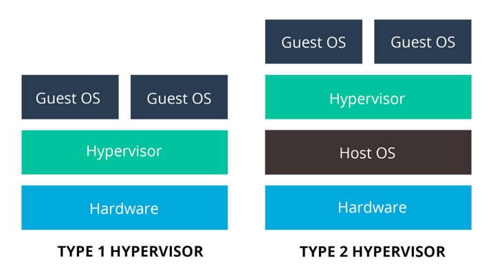 `source:`
[Type 1 and Type 2 Hypervisors: What Makes Them Different | by ResellerClub | ResellerClub | Medium](https://medium.com/teamresellerclub/type-1-and-type-2-hypervisors-what-makes-them-different-6a1755d6ae2c)

---

Dies ist eine Schritt-für-Schritt Anleitung zum Einrichten einer Ubuntu VM
mithilfe von Microsoft SCVMM (System Center Virtual Machine Manager). Falls du
die VM auf deinem eigenen PC installieren möchtest, kannst du auch gerne einen
anderen Hypervisor (z.B. Virtualbox, HyperV) verwenden.

---

Je nach Hypervisor können unterschiedliche Einstellungen zusätzlich getätigt
werden. Die wichtigsten unter HyperV werden hier gelistet, jedoch nicht alle.

Bei Fragen oder Problemen mit dieser Anleitung, wende dich bitte an deinen
Trainer.

---

## Download der RDP Verbindung

---

Um die virtuellen Maschinen zu verwalten, müssen wir uns zuerst mit dem
Hypervisor verbinden. Dafür können wir uns eine `.rdp`-Datei herunterladen,
welche die Verbindung mit einem einfachen Ausführen einer Datei ermöglicht.

---

`.rdp` steht für Remote Desktop Protokoll. Es wird verwendet, um eine Verbindung
zu einem anderen Windows-basierten Computer herzustellen. Sie enthält
Informationen wie die Adresse des Remote-Computers, den Benutzernamen, das
Passwort und bestimmte Konfigurationsoptionen für die Verbindung. Mit einer
`.rdp` Datei, können Benutzer eine Verbindung mit einem Remote-Computer
herstellen, ohne die Verbindung manuell einzurichten.

---

Der Download-Link findet sich unter:
[RD Web Access (lug-ag.de)](https://rds.lug-ag.de/RDWeb)

---

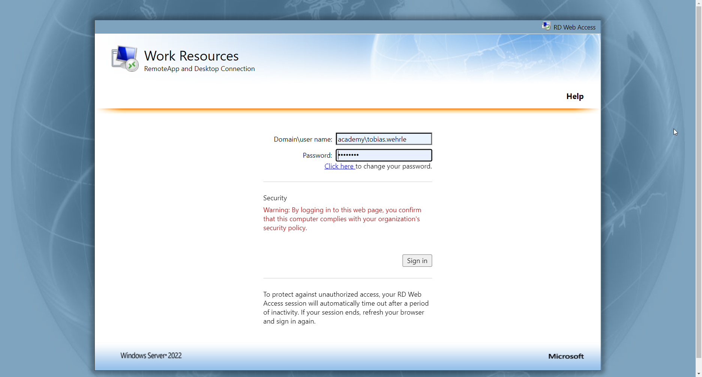

---

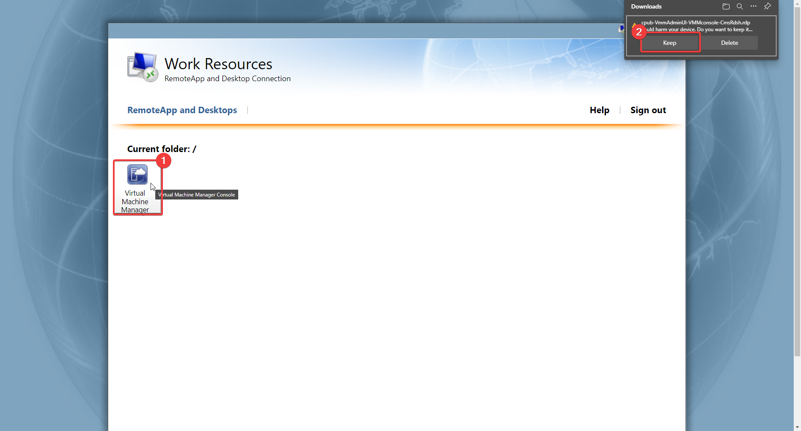

---

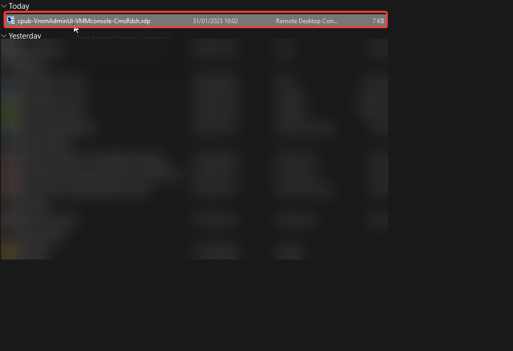

---

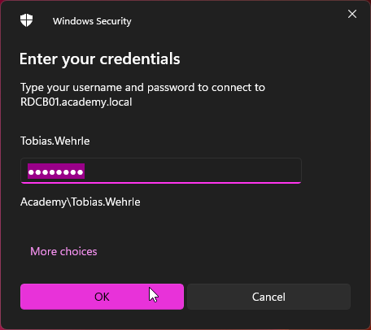

---

## Neue VM einrichten

---

<grid drop="top" drag="100 100">
  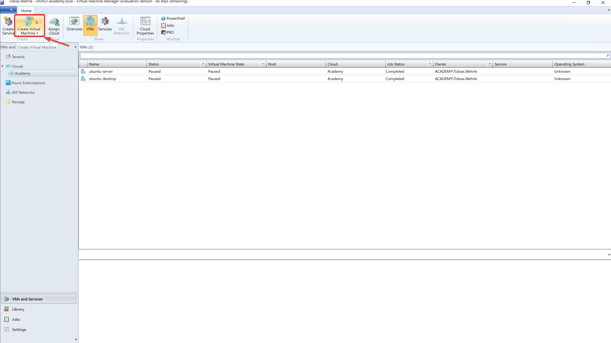

  <grid drop="bottom" drag="70 30" bg="rgb(50,50,50)" border="2px solid black" style="border-radius:20px;padding:20px;">
Um eine neue VM zu erstellen, können wir den Button **Create Virtual Machine** verwenden.
  </grid>
</grid>

---

<grid drop="top" drag="100 100">
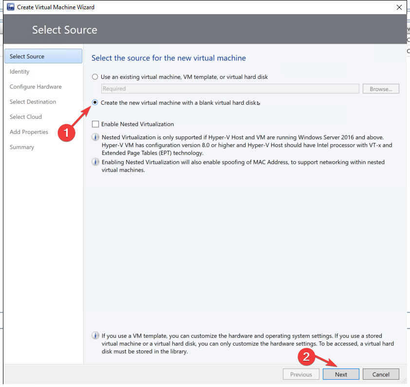

  <grid drop="bottom" drag="70 40" bg="rgb(50,50,50)" border="2px solid black" style="border-radius:20px;padding:20px;">
Da wir keine Vorlage für eine Linux VM auf dem Hypervisor haben, müssen wir mit einer leeren Festplatte anfangen und Ubuntu selbst installieren.

  </grid>
</grid>

---

<grid drop="top" drag="100 100">
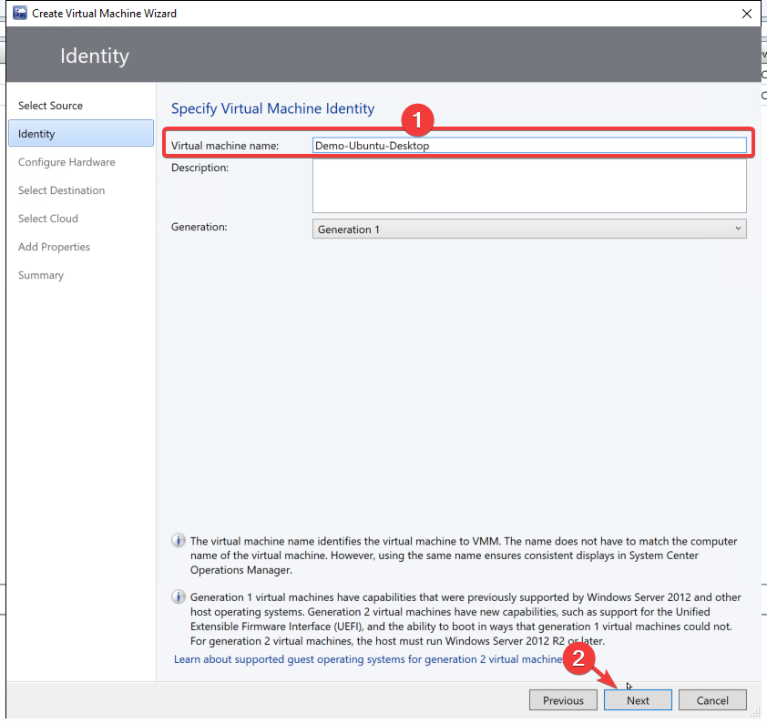

  <grid drop="bottom" drag="70 40" bg="rgb(50,50,50)" border="2px solid black" style="border-radius:20px;padding:20px;">
An dieser Stelle geben wir der VM einen prägnanten **Namen** und geg. eine Kurzbeschreibung. Achte hier bitte darauf, eine Machine der **Generation 2** zu erstellen.

  </grid>
</grid>

---

<grid drop="left" drag="40 100">
Unter "Hardware" stellen wir nun 3 Sachen ein, beginnend mit dem Support für **Hyper-V**. Anschließend müssen wir natürlich die Installationsdatei, sprich die `.iso` Datei für Ubuntu auswählen. 
</grid>

<grid drop="right" drag="55 100">
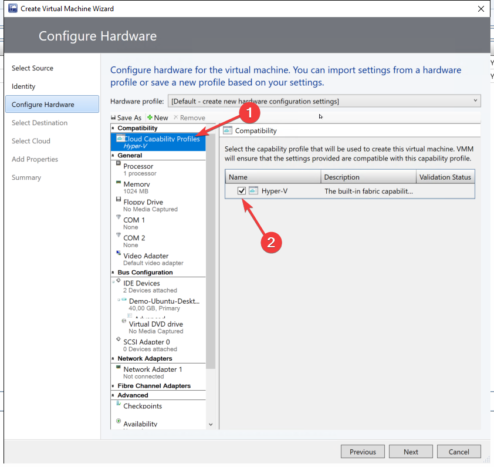
</grid>

---

<grid drop="left" drag="40 100">
Dafür nehmen wir das bereits vorhandene Laufwerk und wählen **Existing ISO image** und danach **Browse**.

</grid>

<grid drop="right" drag="55 100">
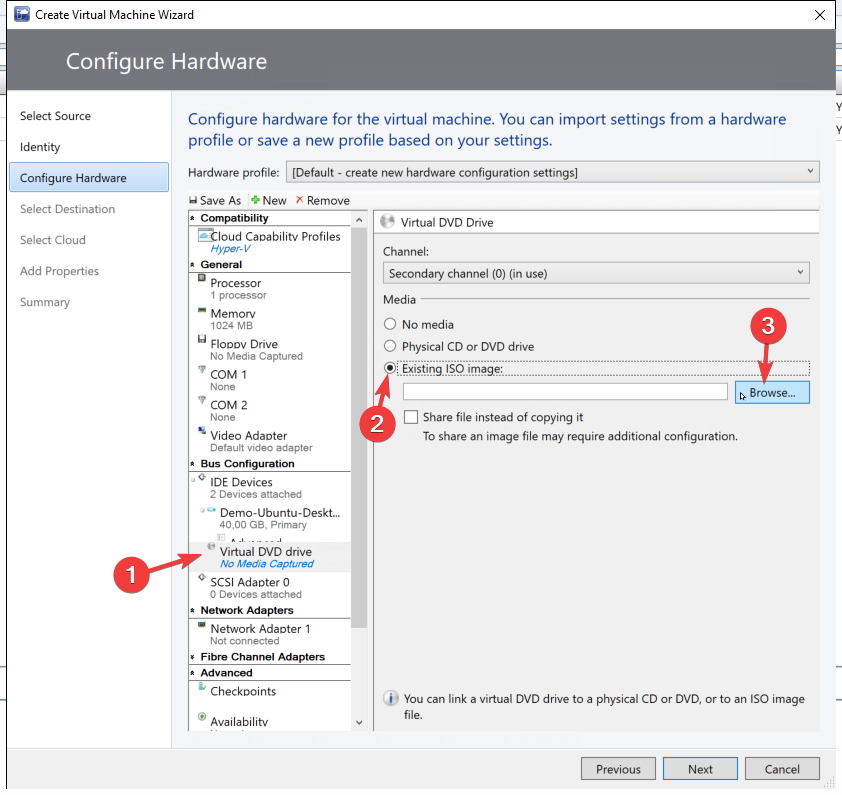
</grid>

---

<grid drop="left" drag="40 100">
Nun können wir die passende `.iso` auswählen.
</grid>

<grid drop="right" drag="55 100">
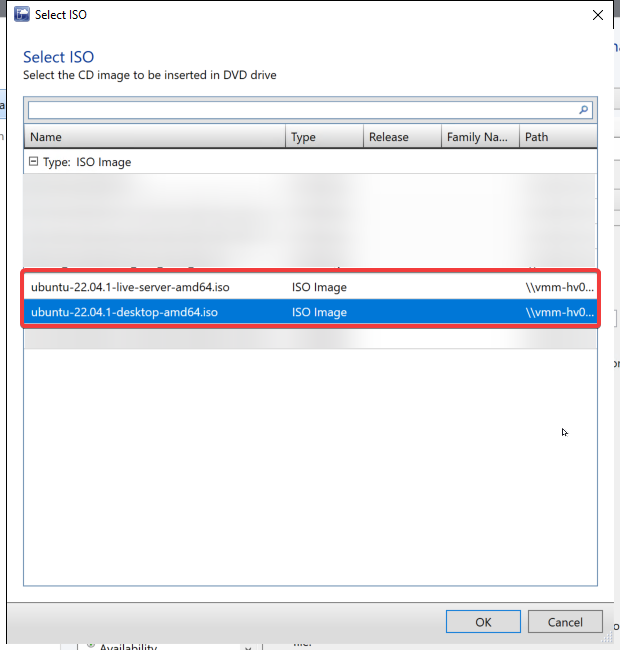
</grid>

---

Zu guter Letzt, wollen wir unter "Hardware" noch eine Netzwerkverbindung
einrichten, damit wir später mit dem Internet verbinden und das System
aktualisieren können.

---

<grid drop="left" drag="40 100">
Wähle dazu den bereits bestehenden **Netzwerkadapter** aus und danach auf **Connected to a VM network** --> **Browse**.
</grid>
<grid drop="right" drag="55 100">
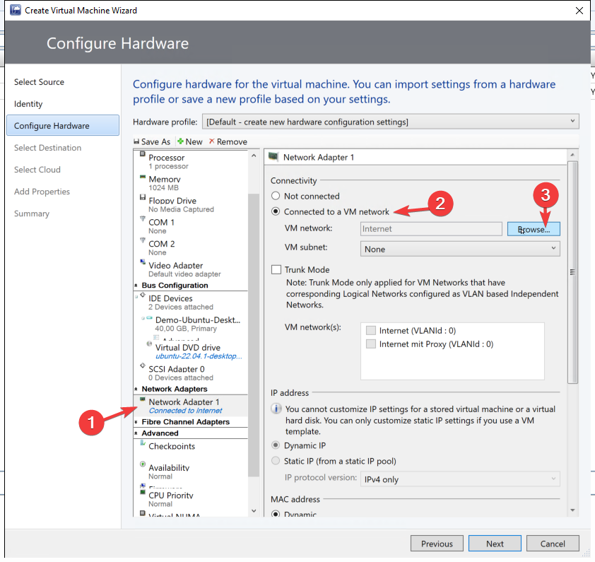
</grid>

---

Hier können wir nun die Verbindung **Internet mit Proxy** auswählen.

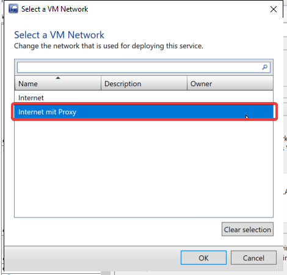

Note: Damit wir tatsächlich ins Internet verbinden können, müssen wir nach der
Installation auch noch den Proxy in Ubuntu Konfigurieren. Mehr dazu später.

---

<grid drop="left" drag="40 100">
Auf dieser Seite kann einfach auf **Next** geklickt werden. Keine Änderung notwendig.
</grid>

<grid drop="right" drag="55 100">
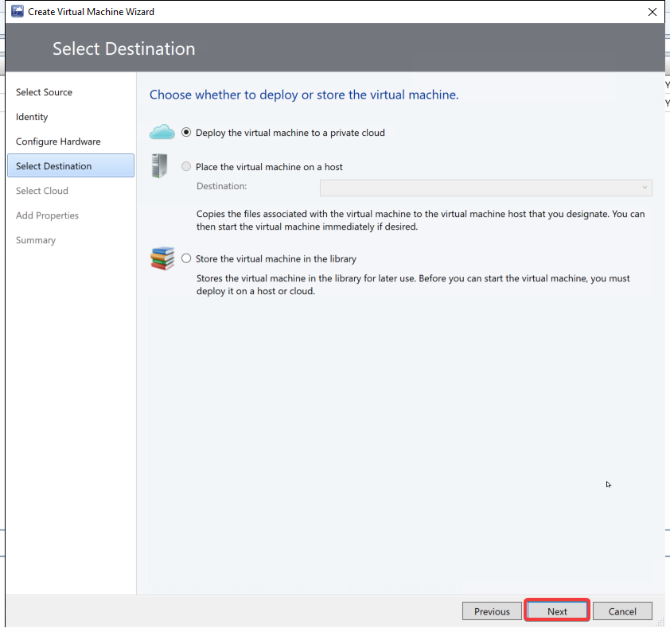
</grid>

---

<grid drop="left" drag="40 100">
Hier sollten nun bei der **Destination**, also dem Ort, wo die VM erstellt wird, 5 Sterne angezeigt werden. 
</grid>

<grid drop="right" drag="55 100">
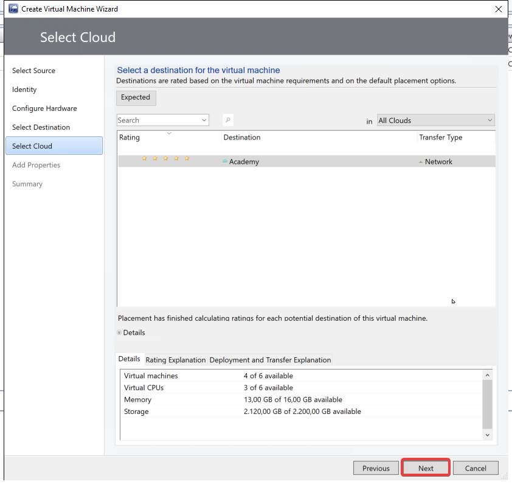
</grid>

---

Falls dies nicht so ist, handelt es sich wahrscheinlich um einen Bug (Fehler).
Wiederhole in diesem Fall die Konfiguration des Servers nochmal von Vorne,
_allerdings_ dieses Mal ohne die Netzwerkverbindung. Diese kann später auch noch
hinzugefügt werden.

---

<grid drop="left" drag="40 100">
Auch hier muss nichts eingestellt werden und kann mit **Next** bestätigt werden.
</grid>

<grid drop="right" drag="55 100">

</grid>

---

<grid drop="top" drag="100 100">
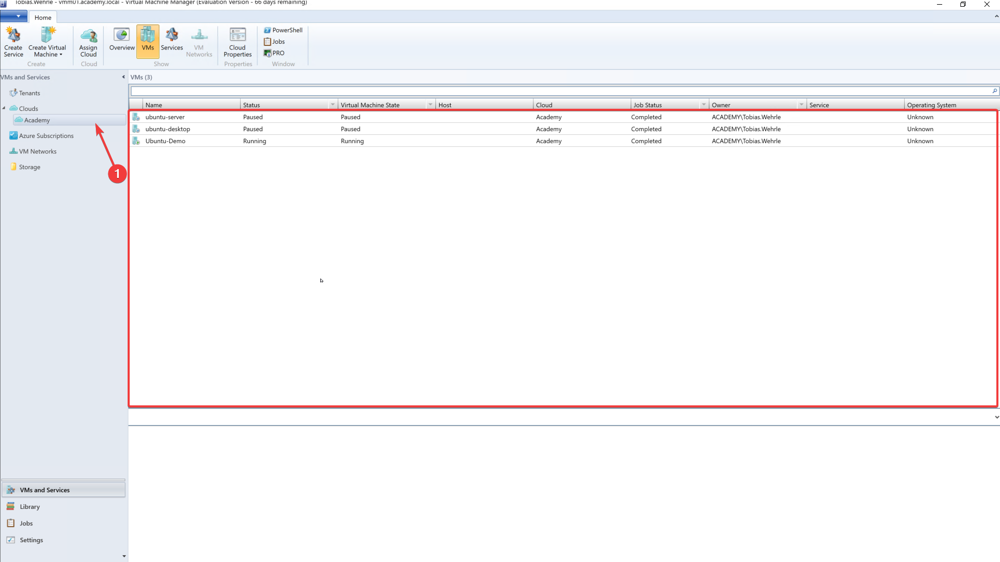

<grid drop="bottom" drag="70 30" bg="rgb(50,50,50)" border="2px solid black" style="border-radius:20px;padding:20px;">
Nun wird die VM erstellt. Das kann je nach Tageszeit ziemlich lange dauern. Sobald die VM erstellt wurde, erscheint diese in der Liste.
</grid>
</grid>

---

<grid drop="top" drag="100 100">
  <grid drag="100 90" drop="top">
  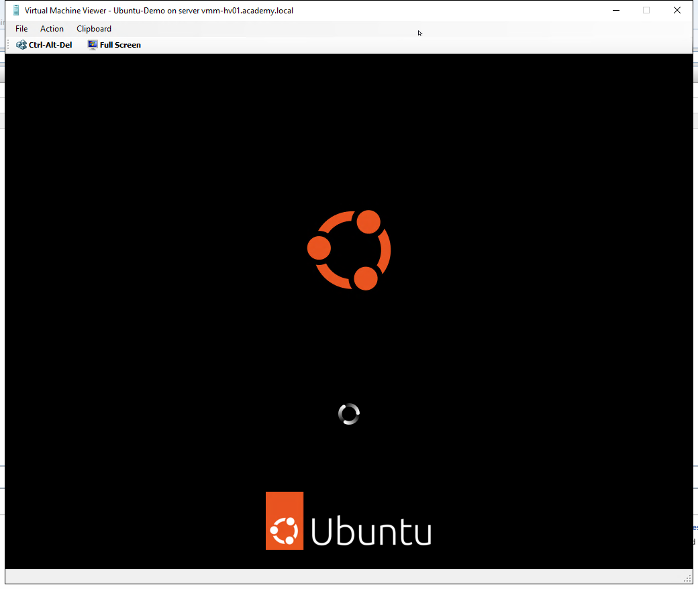
  
  </grid>
  <grid drop="bottom" drag="80 30" bg="rgba(50,50,50,0.7)" border="2px solid black" style="border-radius:20px;padding:20px; color: rgb(200,200,200); text-shadow: 1px 1px 3px black;">
Die Virtuelle Machine lässt sich über das **Rechtsklick-Menü** *Starten*/*Stoppen*/*Pausieren* und damit lässt sich auch auf die VM Verbinden.
  </grid>
</grid>

---

<grid drop="top" drag="100 100">
  <grid drag="100 90" drop="top">
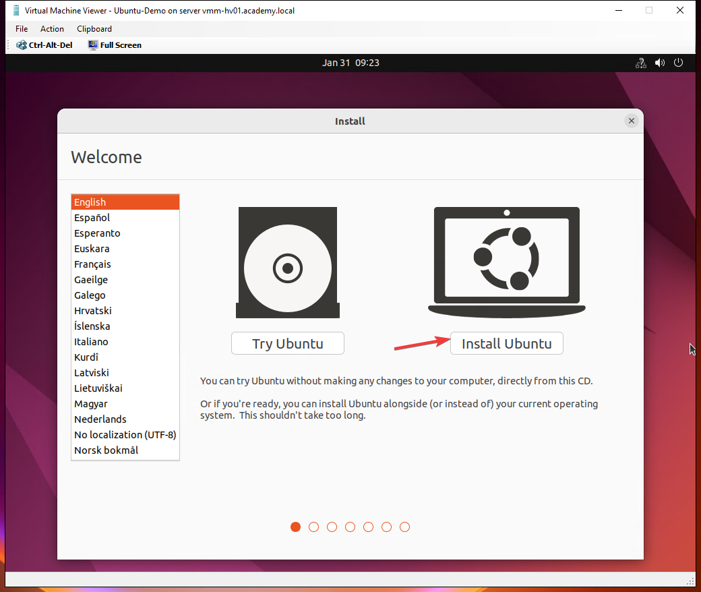
  
  </grid>
  <grid drop="bottom" drag="80 30" bg="rgba(50,50,50,0.7)" border="2px solid black" style="border-radius:20px;padding:20px; color: rgb(200,200,200); text-shadow: 1px 1px 3px black;">
Nachdem wir also die virtuelle Machine konfiguriert und sie gestartet haben, startet sich automatisch der Installer für Ubuntu.

  </grid>
</grid>

---

<grid drop="top" drag="100 100">
  <grid drag="100 90" drop="top">
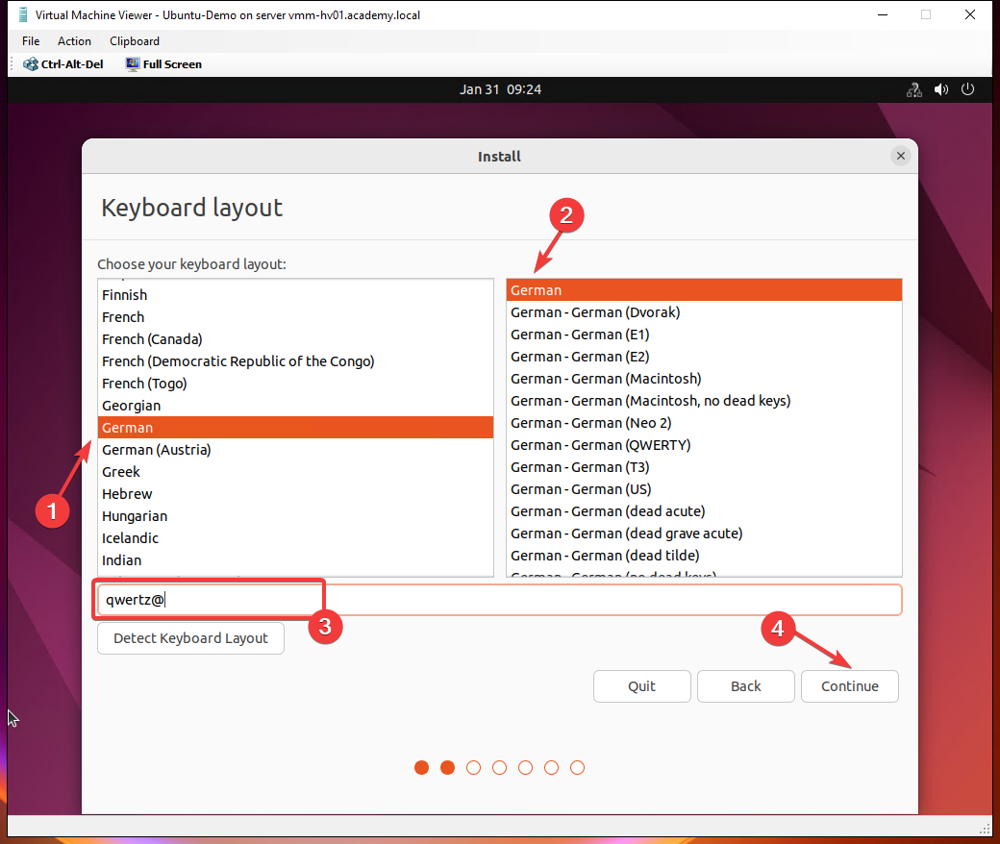
  
  </grid>
  <grid drop="bottom" drag="80 30" bg="rgba(50,50,50,0.7)" border="2px solid black" style="border-radius:20px;padding:20px; color: rgb(200,200,200); text-shadow: 1px 1px 3px black;">

Wir wählen das passende Tastatur-Schema: `German-German` </grid> </grid>

---

<grid drop="top" drag="100 100">
  <grid drag="100 90" drop="top">
  
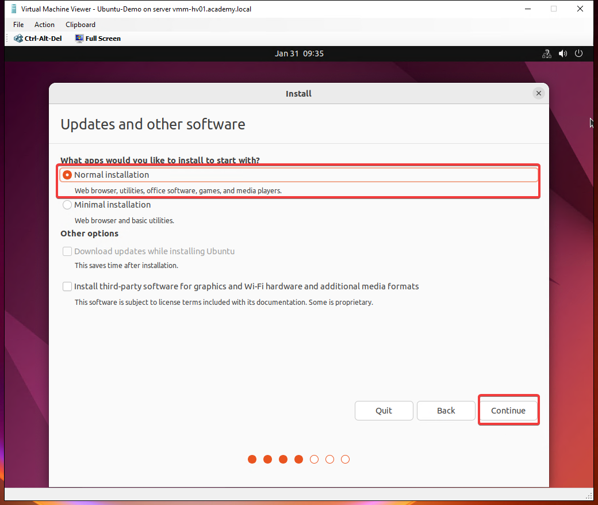
  </grid>
  <grid drop="bottom" drag="80 30" bg="rgba(50,50,50,0.7)" border="2px solid black" style="border-radius:20px;padding:20px; color: rgb(200,200,200); text-shadow: 1px 1px 3px black;">

Wähle `Normale Installation`, damit essentielle Software für die Desktopumgebung
mitinstalliert wird. </grid> </grid>

notes: Falls du Ubuntu, oder eine andere Linux/Unix Distro, installierst, und
eine dedizierte Grafikkarte hast (Gilt auch für Laptops mit MUX-Chip), dann
wählen Sie hier den letzten Punk ebenfalls aus. Dieser installiert automatisch
die passenden Treiber des Herstellers (`proprietary`) für Ihre Hardware.

---

<grid drop="top" drag="100 100">
  <grid drag="100 90" drop="top">
  
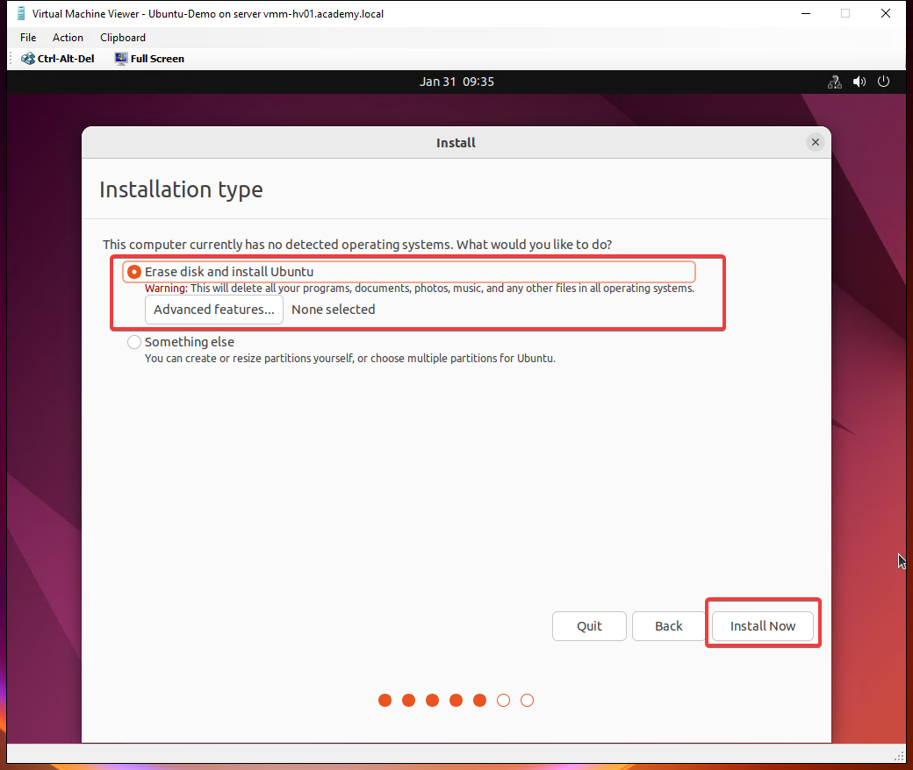
  </grid>
  <grid drop="bottom" drag="80 30" bg="rgba(50,50,50,0.7)" border="2px solid black" style="border-radius:20px;padding:20px; color: rgb(200,200,200); text-shadow: 1px 1px 3px black;">

Hier könnten wir die Festplatte/n manuell formatieren. Wir vertrauen einfach
darauf, dass Ubuntu sinnvolle "defaults" wählt. </grid> </grid>

notes: Du kannst unter `advanced features` noch folgende Features aktivieren:

- `Use LVM with the new Ubuntu installation`
  - **L**ogical **V**olume **M**anagement
  - LVM (Logical Volume Management) ist ein Dateisystem-Management-System in
    Linux, das es ermöglicht, Festplatten und Partitionen dynamisch zu verwalten
    und zu verändern, ohne Daten zu verlieren. Mit LVM kann man zum Beispiel
    Speicher hinzufügen, ohne dass ein Systemneustart erforderlich ist, und man
    kann auch einfach Partitionen vergrößern oder verkleinern.
- `Encrypt the new Ubuntu installation for security`
  - Verschlüsselt die komplette Ubuntu-Installation mit einem Passwort, welches
    beim Boot angegeben werden muss.
- `Erase disk and use zfs`
  - ZFS --> Modernes FileSystem, funktionen wie Datenintegrität, Snapshots,
    Deduplizierung
  - Gut für fortgeschritte Anwender

---

<grid drop="top" drag="100 100">
  <grid drag="100 90" drop="top">
  
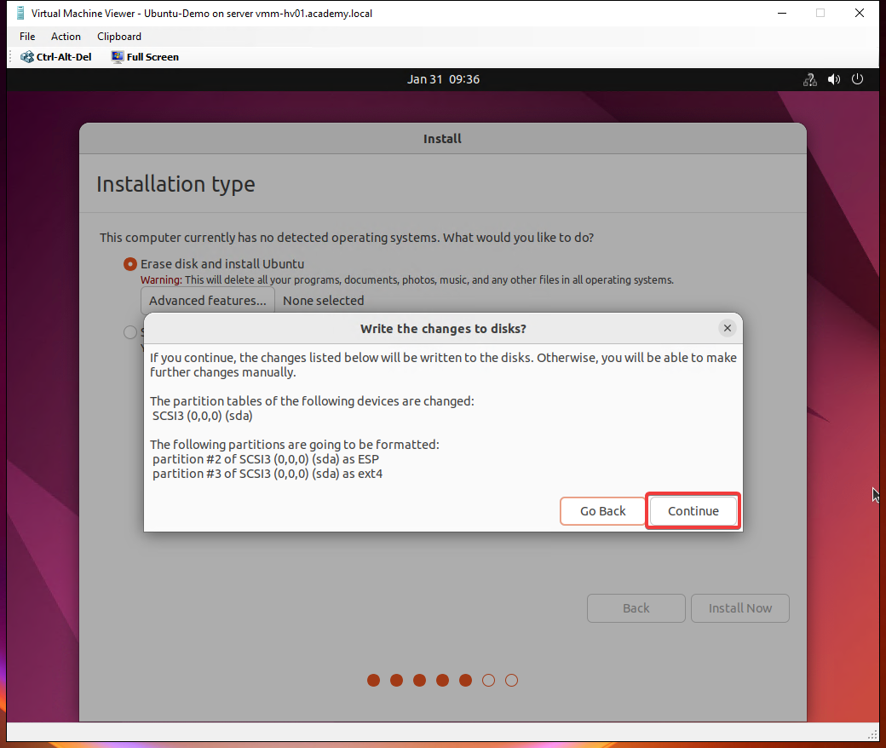
  </grid>
  <grid drop="bottom" drag="80 30" bg="rgba(50,50,50,0.7)" border="2px solid black" style="border-radius:20px;padding:20px; color: rgb(200,200,200); text-shadow: 1px 1px 3px black;">

Wenn wir auf `Install Now` klicken, werden wir nochmal geben die zu erstellenden
Partitionen zu überprüfen. </grid> </grid>

---

<grid drop="top" drag="100 100">
  <grid drag="100 90" drop="top">
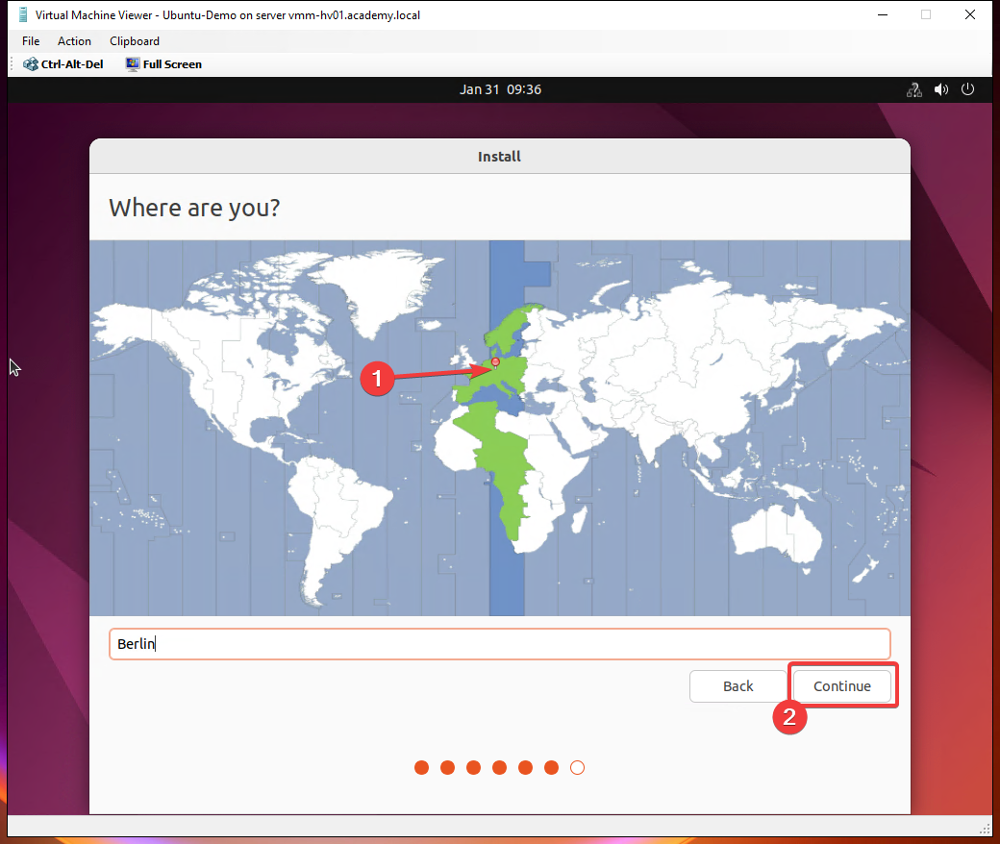
  
  </grid>
  <grid drop="bottom" drag="80 20" bg="rgba(50,50,50,0.7)" border="2px solid black" style="border-radius:20px;padding:20px; color: rgb(200,200,200); text-shadow: 1px 1px 3px black;">

Nun müssen wir die Zeitzone angeben. Für uns ist das natürlich Berlin. </grid>
</grid>

---

<grid drop="top" drag="100 100">
  <grid drag="100 90" drop="top">
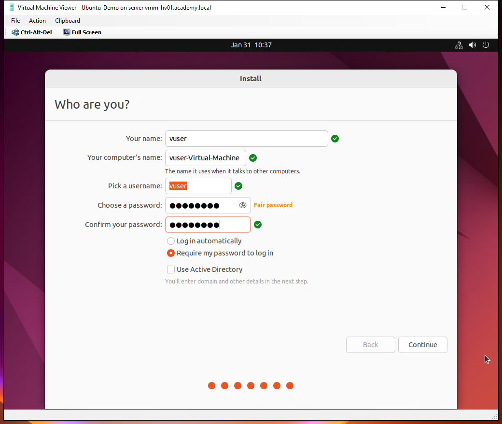
  </grid>
  <grid drop="bottom" drag="80 30" bg="rgba(50,50,50,0.7)" border="2px solid black" style="border-radius:20px;padding:20px; color: rgb(200,200,200); text-shadow: 1px 1px 3px black;">

Zu guter Letzt, müssen wir nun unseren initialen Benutzer festlegen, welcher
gleichzeitig Adminstrator-Rechte bekommt. </grid> </grid>

notes: Wähle hier auf jeden Fall, wenn du ins Internet möchtest, ein starkes
Passwort und loggen Sie sich am besten **manuell** und **nicht automatisch**
ein. Das regt dich dazu an, dir das Passwort schnell zu merken. Später nehmen
wir regelmäßig Änderungen am System vor und diese Befehle müssen eben auch mit
dem Passwort bestätigen werden.

---

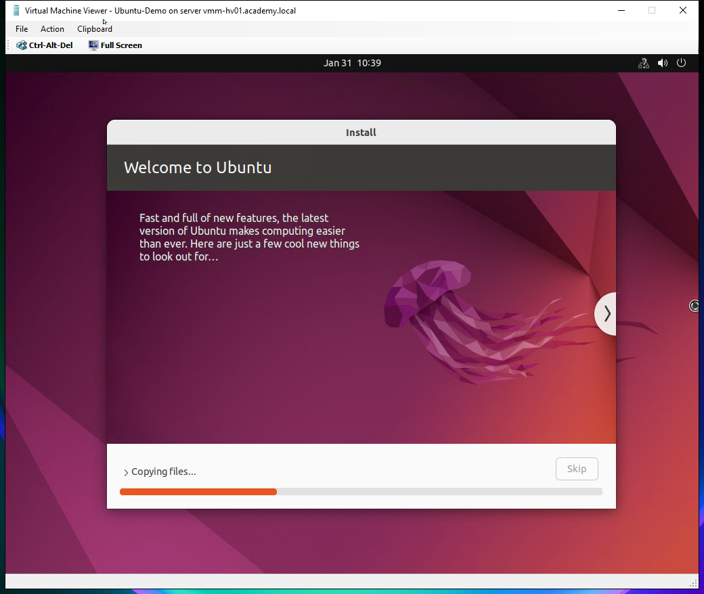

notes: ...loading...

---

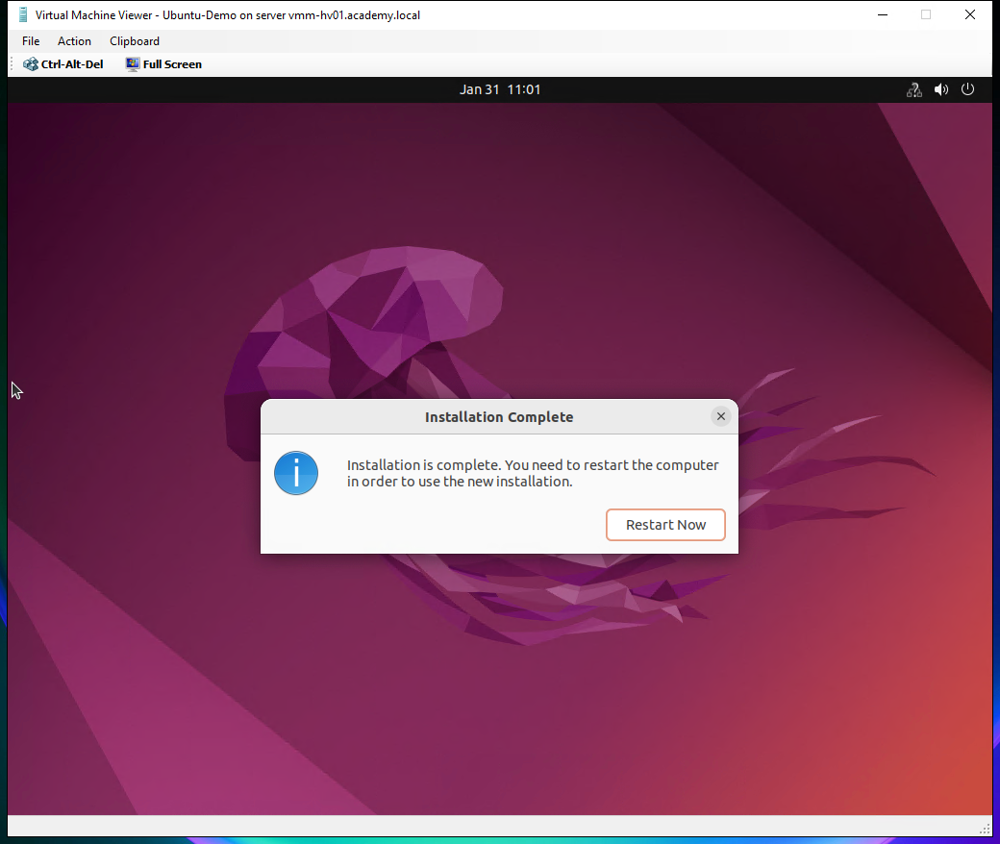

notes: Nach der Installation, müssen wir natürlich das System noch neustarten.
Gegebenfalls kommt nach diesem Bildschirm nochmal ein Terminal, wo wir
aufgefordert werden das _Installationsmedium_ zu entfernen und mit **Enter** zu
bestätigen. Einfach den Anweisungen folgen ^-^

---

<grid drop="top" drag="100 100">
  <grid drag="100 90" drop="top">

  
  </grid>
  <grid drop="bottom" drag="80 30" bg="rgba(50,50,50,0.7)" border="2px solid black" style="border-radius:20px;padding:20px; color: rgb(200,200,200); text-shadow: 1px 1px 3px black;">

Nach der Installation können wir uns als unserem `Admin-Benutzer` anmelden.
</grid> </grid>

---

<grid drop="top" drag="100 100">
  <grid drag="100 90" drop="top">
  
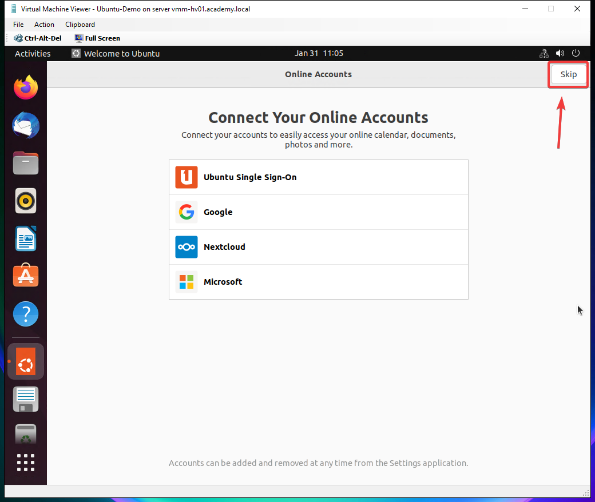
  </grid>
  <grid drop="bottom" drag="80 30" bg="rgba(50,50,50,0.7)" border="2px solid black" style="border-radius:20px;padding:20px; color: rgb(200,200,200); text-shadow: 1px 1px 3px black;">

Nach der Anmeldung, beim ersten Start, werden wir mit diesem Bildschirm
begrüsst. Klicken Sie sich hier einfach oben rechts über `skip` durch die Menüs.
</grid> </grid>

---

## Basiseinstellungen

> Slides haben Sub-Sections (d.h. **Erst nach unten**, anschließend nach rechts
> weiter)

--

Die Proxy Einstellungen müssen **nur** Nutzer des **Schul-Hypervisors**
einrichten!

---

### Performance-Hack für SCVMM

--

Um etwas weniger Latenz bei der Nutzung von SCVMM zu haben, fügen wir
`blacklist hyperv_fb` an das Ende der `/etc/modprobe.d/blacklist.conf` Datei
hinzu.

--

`sudo nano /etc/modprobe.d/blacklist.conf`

**`/etc/modprobe.d/blacklist.conf`**

```conf
...
blacklist hyperv_fb
```

notes:

`_fb` steht hier für Frame-Buffer. Was wir hier machen, ist ein Kernel-Modul,
welches für den HyperV-Framebuffer verantwortlich ist, zu deaktivieren.
Kernel-Module sind, unter anderem, Geräte-Treiber.

--

Anschließend ein Reboot, dann sollte alles etwas schneller wirken.

---

### Proxy für APT

--

Da wir bei den VM's nur über einen Proxy-Server ins Internet verbinden können,
müssen wir diesen zuerst einstellen, bevor wir mit dem System arbeiten können.

--

Dafür öffnen wir mit dem Texteditor **nano** die Proxy Konfigurations-Datei,
welche in `/etc/apt/apt.conf.d/proxy.conf` liegt. Dabei müssen wir vor dem
eigentlichen Command, den wir ausführen wollen **sudo** schreiben, um den Befehl
mit Administratorberechtigungen auszuführen, da dieser Ordner nicht für unseren
Standard-Benutzer verfügbar ist.

```bash
sudo nano /etc/apt/apt.conf.d/proxy.conf
```

--

**`/etc/apt/apt.conf.d/proxy.conf`**

```conf
Acquire {
	HTTP::proxy "http://"<addresse>:<port>";
	HTTPS::proxy "http://"<addresse>:<port>";
}
```

Für unsere Zwecke ist die Adresse des `http`- und `https`-Proxies die gleiche,
allerdings müssen wir in jedem Fall für beide Zeilen eine Adresse angeben. Im
Zweifelsfall entspricht die Adresse des `https` Proxies, die des `http` Proxies.

--

Wenn wir die Datei nun speichern und wieder schließen, und dann nochmals **apt**
aufrufen, sollten wir eine Verbindung mit dem Internet bekommen.

```bash
sudo apt update
```

> Sollte dieser Befehl noch immer Fehlschlagen, springen Sie zur Sektion
> [Troubleshooting](#Troubleshooting).

---

### Proxy für HTTP und sonstige Protokolle

--

Mit Außnahme von `apt` nutzen die meißten Linux Programme die Proxy Server,
welcher in der Umgebungsvariablen `HTTP_PROXY` und `HTTPS_PROXY` definiert sind.
Die Umgebungsvariablen können wie folgt gesetzt werden:

```bash
export HTTP_PROXY=<adresse>:<port>
export HTTPS_PROXY=<adresse>:<port>
```

--

Wenn du diesen Befehl in der Konsole verwendest, dann wird die Umgebungsvariable
einmalig gesetzt. Wenn also nach diesem Befehl die Verbindung funktioniert, dann
solltest du die Umgebungsvariablen permanent setzen, zum Beispiel über die
`.bashrc` Datei.

--

Ob unsere Einstellung funktioniert, können wir ganz einfach mit `curl` **oder**
`wget` testen:

```bash
curl -I www.google.com # oder
wget --spider www.google.com
```

--

> Hinweis: `ping` nutzt das ICMP-Protokoll und ist zum testen einer
> HTTP-Verbindung nicht geeignet!

---

## Troubleshooting

---

### Keine Internetverbindung trotz eingestelltem Proxy

--

1. Überprüfe die Proxy-Einstellungen: Stelle sicher, dass die richtigen
   Proxy-Einstellungen in deiner `/etc/apt/apt.conf.d/proxy.conf` eingestellt
   sind. Überprüfe den Syntax der Einstellungen und die Berechtigungen der Datei
   (`-rw-r--r--`, bzw. `644`).

--

2. Überprüf die Netzwerkverbindung: Vergewissere dich, dass dein Computer eine
   aktive Netzwerkverbindung hat und dass er eine IP-Adresse vom DHCP-Server
   erhält. Du kannst mit folgendem Command die Lease erneuern lassen:

```bash
sudo dhclient -r && sudo dhclient
```

--

3. Überprüfe die Firewall-Einstellungen: Vergewissere dich sich, dass die
   Firewall-Einstellungen die Verbindung zum Internet nicht blockieren.

--

4. Überprüfe den APT-Cache: Versuche, den APT-Cache zu bereinigen, indem du
   `sudo apt-get clean` ausführst.

---

### Enhanced Session - HyperV

--

Folgende Anleitung ist **nur** relevant für **HyperV** Benutzer, welche die VM
manuell eingerichtet haben (also _kein Quick-Create_ genutzt haben).

Um die "Erweiterte Sitzung" mit besseren Display-Treibern und Textscaling zu
nutzen, müssen wir unter Linux noch zusätzliche Konfiguration vornehmen. Dieses
Beispiel ist für Ubuntu als VM unter HyperV.

--

#### 1. Installation der Zusatzkomponenten in Linux

Da es für die erweiterte XRDP Sitzung mehrere Komponenten und Konfiguration
benötigt, können wir von der Communtity geschriebene Scripts verwenden. Dafür
müssen wir jedoch das richtige raus suchen. Eine zuverlässige Quelle für solche
Scripts ist folgender Github Account:
[Hinara/linux-vm-tools](https://github.com/Hinara/linux-vm-tools/)

--

[Hinara/linux-vm-tools](https://github.com/Hinara/linux-vm-tools/)

Dort müssen wir nach der richtigen Distro und Version suchen, z.B. wenn wir als
VM Ubuntu 22.04.1 nutzen, dann gehen wir auf `/ubuntu/22.04/install.sh`.

--

<grid drag="100 100">
  <grid drag="100 80" drop="bottom">
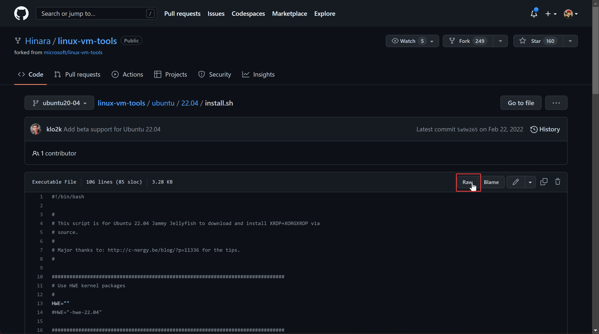
  
  </grid>
  <grid drop="top" drag="80 30" bg="rgba(50,50,50,0.7)" border="2px solid black" style="border-radius:20px;padding:20px; color: rgb(200,200,200); text-shadow: 1px 1px 3px black;">
Auf `raw` klicken, dann bekommen wir die reine Textversion, welche wir mithilfe von `wget` oder `curl` runterladen können. 
  </grid>
</grid>

--

```bash
wget https://raw.githubusercontent.com/Hinara/linux-vm-tools/ubuntu20-04/ubuntu/22.04/install.sh
```

--

Das Script muss vor der Ausführung erstmal ausführbar gemacht werden...

```bash
sudo chmod u+x ./install.sh
```

--

... und kann anschließend mit diesem Befehl **mit sudo** gestartet werden:

```bash
sudo ./install.sh
```

Nach der Installation muss die VM (Ubuntu in diesem Fall) neu gestartet werden:
`sudo reboot`

--

#### Aktivierung der erweiterten Sitzung in Windows

--

Damit wir nun die erweiterte Sitzung in der Linux VM nutzen können, müssen wir
diese erst aktivieren.

Alle folgenden Befehle in diesem Abschnitt müssen aus einer **Powershell** mit
**Administrator-Berechtigung** ausgeführt werden!

--

```powershell
Get-VMHost | select Name, EnableEnhancedSessionMode
```

**`output:`**

```shell
PS C:\WINDOWS\system32> Get-VMHost | select Name, EnableEnhancedSessionMode

Name          EnableEnhancedSessionMode
----          -------------------------
Computer-Name                      False

PS C:\WINDOWS\system32>
```

--

Den `EnhancedSessionMode` können wir mit folgendem Befehl für den VMHost
aktivieren, falls er noch nicht auf `true` gesetzt ist.

```powershell
Set-VMHost -EnableEnhancedSessionMode $true
```

--

Anschließend aktivieren wir den `EnhancedSessionMode` für die spezifische VM mit
folgendem Befehl, wobei `"Name-der-VM"` mit dem tatsächlichen Namen der VM
ersetzt werden muss.

```powershell
Set-VM -VMName "Name-der-VM" -EnhancedSessionTransportType HvSocket
```

--

Danach sollte sich der `EnhancedSessionMode` starten lassen. Falls dies nicht
der Fall ist, kann gegebenenfalls ein Neustart des Hosts notwendig sein.

---

## Ende?

Weiter geht’s hier:

[LUG-Learn | Die erste Stunde mit Linux](https://lug-learn.netlify.app/linux/linux-die-erste-stunde/)

Eine Geschichtsstunde zur Entstehung von Linux gibt es hier:

[LUG-Learn | Die Geschichte von Linux](https://lug-learn.netlify.app/linux/linux-geschichte/)
