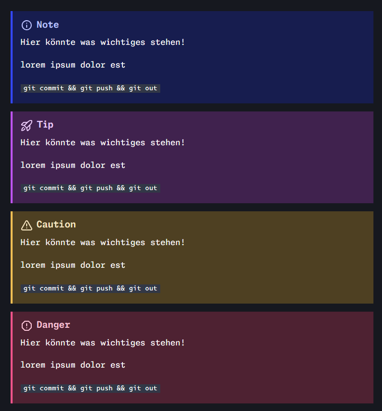

Du hast dich dafür entschieden bei diesem Projekt mitzuhelfen! 💪

:::note

Falls du es noch nicht getan hast, solltest du unserem [Discord Server](https://discord.gg/NzHk4m7d5w) beitreten. Dort kannst du Fragen zu den hier dargestellten Themen beantwortet bekommen, Themen- oder Verbesserungsvorschläge einbringen oder dich mit gleichgesinnten austauschen.

:::

## Regeln zum Format

Wir verwenden für unsere Docs den erweiterten Markdown Standard. Ein Cheat-Sheet mit den wichtigsten Regeln findest du [hier](https://www.markdownguide.org/cheat-sheet/). Ausgenommen davon sind:

- ~~Definition List~~
- ~~Emoji mit `:joy:` oder ähnliche~~
- ~~Heading-IDs~~

**Emojis können als UTF8 Text hinzugefügt werden**, beispielsweise über das Windows Emoji Keyboard `<WIN>+.`

### Frontmatter

Jedes Markdown oder MDX Dokument **muss mit einer Frontmatter-Sektion** mit *mindestens dem `title`* der Seite beginnen. Das sieht dann wie folgt aus:

```markdown
---
title: Meine Überschrift
description: Hier könnte deine Werbung stehen!
---
```

Es gibt neben dem Title weitere Eigenschaften, welche es sich zu setzen lohnen. Eine Liste mit allen Optionen findet sich in den [Starlight-Docs](https://starlight.astro.build/de/reference/frontmatter/).

### Headings

```markdown
## Sektion 1

### Subheading 1.1

### Subheading 1.2

#### SubSubheading 1.2.1

## Sektion 2
```

- Neue Sektionen beginnen mit Heading 2 und aufwärts! **Heading 1 ist für die Seitenüberschrift reserviert.**
- **In der Sidebar** (Table of Content) werden **lediglich Heading 2-3 angezeigt**.
- Headings sollten möglichst kurz und bezeichnend sein.
- Headings dürfen nicht mit Satzzeichen enden (Beispiel ":" oder ".")

### Heading Links

Heading-IDs werden von der Website automatisch für alle **Überschriften (ab H2)** generiert. Beachte bitte, dass die Art wie Obsidian automatisch Links erstellt `[[]]` noch nicht mit unserer Website kompatibel ist.

Hier ein paar praktische Beispiele für interne Links:

```markdown
## Table of Content

- [Einleitung](#einleitung)
- [Hauptteil](#überschrift-mit-leerzeichen)
- [Zusammenfassung](#zusammenfassung)
- [Link auf andere Seite](/start/contribution#)

## Einleitung

## Überschrift mit Leerzeichen

## Zusammenfassung
```

### Links zu anderen Dokumenten

Links auf andere Dokumente auf Evil-Docs folgen ebenfalls einer gewissen Konvention, basierend auf dem URL-Parser. Hier ein Beispiel für funktionierende Links auf ein anderes Dokument:

```markdown
[Übersichtsseite](/git/uebersicht)
[Heading in Übersichtsseite](/git/uebersicht#3-die-objekte)
```

### Lokale Bilder

Lokale Bilder lassen sich über den einfachen Markdown-Syntax in Dokumente einbauen. Bilder müssen in `/assets` oder einem beliebigen Unterordner von `/assets` abgelegt werden.

```markdown
...
Das folgende Bild wird auf der Seite mit der Originalgröße gerendert.

Das folgende Bild wird auf der Seite in Größe 800px x 600px gerendert.

```

### Lokale Videos

Um lokale Videos (in `/assets`) auf der Seite anzuzeigen, müssen wir die Dateiendung von `.md` auf `.mdx` ändern.

MDX lässt uns neben dem Standard-Markdown Syntax auch `JSX` in der Textdatei nutzen. **JSX ist der Syntax**, welcher in der moderner Webentwicklung für sogenannte *Webkomponenten* verwendet wird.

Da wir die **Videos im Source-Code** zur Build-Time des Webservers inkludieren, müssen wir diese innerhalb einer `.mdx` Datei **importieren und dann in ein HTML-Video Element im `src` Attribut hinzufügen**. Dafür ist grundsätzlich *kein JavaScript Wissen notwendig*.

```markdown
import demoVF from "../assets/demo-variable-fonts.mp4";

<video src={demoVF} alt="Variable font demo with nav-links" controls></video>
```

- Mehr über [MDX](https://mdxjs.com/)


## Zusätzliche Features

Neben den Features des Markdown-Specs, haben wir einige weitere Features, welche zwar nicht von allen Markdown-Editoren unterstützt werden, aber auf unserer Learn-Seite funktionieren und korrekt angezeigt werden. Im folgenden werden die wichtigsten Elemente aufgezeigt. Eine Liste mit allen Komponenten, die Astro Starlight uns anbietet, findest du [hier](https://starlight.astro.build/guides/components/#built-in-components).

### Asides

Asides (Auch "Admonitions" oder "Callouts" genannt) sind Bemerkungen, welche sekundäre Informationen, neben dem eigentlichen Inhalt darstellen. Der Inhalt eines Aside-Elements wird in dreifachen Doppelpunkten `:::`, gefolgt von dem Typ des Asides, umschlossen. Folgende Typen sind möglich:

- `note`: Eine generelle Nebeninformation
  - Blaue Farbe mit Info-Icon
- `tip`: Ein praktischer aber optionaler Tip, welcher helfen kann, aber nicht muss
  - Lila Farbe mit Raketen-Icon
- `caution`: Wichtige Information, welche nicht überlesen werden darf
  - Gelbe Farbe mit Warnungs-Icon
- `danger`: Essentielle Information, welche nicht überlesen werden darf
  - Rote Farbe mit Gefahren-Icon

```markdown
:::note

Hier könnte was wichtiges stehen!

lorem ipsum dolor est

`git commit && git push && git out`

:::
```

So sehen die Asides auf der Webseite aus:



Asides können außerdem benutzerdefinierte Überschriften haben:

```markdown
:::note[Wusstest du schon?]

Hier könnte was wichtiges stehen!

lorem ipsum dolor est

`git commit && git push && git out`

:::
```

### Code Blöcke

Markdown unterstützt im Standard Spec Codeblöcke mit Syntax-Highlighting, welche wir mit dreifachen Backticks ` ``` `, gefolgt von der Sprache, erstellen können.

```js
// Javascript code with syntax highlighting.
var fun = function lang(l) {
  dateformat.i18n = require('./lang/' + l);
  return true;
};
```

```markdown
```js
// Javascript code with syntax highlighting.
var fun = function lang(l) {
  dateformat.i18n = require('./lang/' + l);
  return true;
};
```.
```

Nutzen wir als Sprache eine Shell-Sprache (`bash`, `powershell`), dann wird der Code-Block in einem Terminal-Ähnlichen Element dargestellt:

```bash
npm install
```

### File-Tree

In technischer Dokumentation kommt es häufig vor, dass wir eine Ordner- und Dateistruktur mit den enthaltenen Dateien darstellen wollen. Dafür können wir die von Astro Starlight mitgelieferte `FileTree`-Komponente nutzen.

In der File-Tree Komponente werden die Dateien und Ordner in einer einfachen ungeordneten Markdown-Liste angegeben. Ordner-Bezeichner müssen mit `/` enden.

- Hebe eine Datei oder einen Ordner besonderst hervor, z.B. `**astro.config.mjs**`.
- Füge einen Kommentar direkt nach dem Datei-/Ordnernamen hinzu, z.B. `package.json Manifest`.
- Nutze Platzhalter für nicht-relevante Ordner und Dateien hinzu.

```markdown title="readme.md" {21,25-26}
## Astro Projekt

Ein Ordner mit einem Astro-Projekt sieht wie folgt aus:

import { FileTree } from "@astrojs/starlight/components";

<FileTree>
- public/
  - robots.txt
  - favicon.svg
  - social-image.png
- src/
  - components/
    - Header.astro
    - Button.jsx
  - layouts/
    - PostLayout.astro
  - pages/
    - posts/
      - post1.md
      - ...
    - index.astro
  - styles/
    - global.css
- **astro.config.mjs**
- package.json Manifest
- tsconfig.json
</FileTree>
```

Gerendert sieht das dann so aus:

import { FileTree } from "@astrojs/starlight/components";

<FileTree>
- public/
  - robots.txt
  - favicon.svg
  - social-image.png
- src/
  - components/
    - Header.astro
    - Button.jsx
  - layouts/
    - PostLayout.astro
  - pages/
    - posts/
      - post1.md
      - ...
    - index.astro
  - styles/
    - global.css
- **astro.config.mjs**
- package.json Manifest
- tsconfig.json
</FileTree>
### Expressive Code

Mit dem Expressive Code Feature von Astro, kannst du Code-Blöcke mit zusätzlichen Highlights aufwerten. Nach der Deklaration der Sprache, kannst du Zeilen hervorheben mit `{}`. Eine `{1}`, mehrere `{2,3,7}` von-bis `{2-4}` oder eine Kombination daraus. Außerdem können wir den Dateinamen mit `title="file.ext"` angeben.

```js title="main.js" {2-4}
// Javascript code with syntax highlighting.
var fun = function lang(l) {
  dateformat.i18n = require('./lang/' + l);
  return true;
};
```

```markdown title="readme.md"
```js title="main.js" {2-4}
// Javascript code with syntax highlighting.
var fun = function lang(l) {
  dateformat.i18n = require('./lang/' + l);
  return true;
};
```.
```

Bei Codeblöcken mit einer Shell Sprache, können wir als Titel nutzen, um den Arbeitsschritt zu erläutern:

```bash title="Installiere Abhängigkeiten..."
npm install
```

Highlights können ebenfalls für individuelle Wörter oder sogar mit Regular Expressions definiert werden.

```js title="greeting.js" "Wörter" /Sogar.*ns/
// Individuelle Wörter und Satzteile können markiert werden
function greet() {
  return 'Sogar Regular Expressions sind möglich';
}
```

```markdown title="readme.md"
```js title="greeting.js" "Wörter" /Sogar.*ns/
// Individuelle Wörter und Satzteile können markiert werden
function greet() {
  return 'Sogar Regular Expressions sind möglich';
}
```.
```


Wenn man Code-Snippets teilt, möchte man eventuell Änderungen an einer Datei aufzeigen. Mit `ins=` und `del=` kannst du aufzeigen, welche Zeilen entfernt, bzw. hinzugefügt werden müssen.


```js title="demo.js" del={3} ins={4} {5}
// Javascript code with syntax highlighting.
function demo() {
  console.log("Marker zum entfernen von Codezeilen");
  console.log("Marker zum hinzufügen von Codezeilen");
  return true;
};
```

```markdown title="readme.md"
```js title="demo.js" del={3} ins={4} {5}
// Javascript code with syntax highlighting.
function demo() {
  console.log("Marker zum entfernen von Codezeilen");
  console.log("Marker zum hinzufügen von Codezeilen");
  return true;
};
```.
```

Der Syntax für `del=` und `ins=` funktioniert ebenfalls mit einzelnen Wörtern oder Satzteilen. Hier ein komplexeres Beispiel:

```js title="demo.js" del="World!" ins="Peoples!" del=/var bad[\w]*/ ins=/let better[\w]*/
// Javascript code with syntax highlighting.
function greeting() {
  console.log("Hello World!Peoples!");
  var badPractice let betterPractice = 10;
  var badName let betterName = "test";
};
```

```markdown title="readme.md"
```js title="demo.js" del="World!" ins="Peoples!" del=/var bad[\w]*/ ins=/let better[\w]*/
// Javascript code with syntax highlighting.
function greeting() {
  console.log("Hello World!Peoples!");
};
```.
```

Zu guter Letzt, gibt es noch den `Diff-Like` Syntax, wo wir Zeilen mit `+` und `-` Präfixen können.

```diff lang="js" title="main.js" {1}
function thisIsJavaScript() {
  // This entire block gets highlighted as JavaScript,
  // and we can still add diff markers to it!
-  console.log('Old code to be removed')
+  console.log('New and shiny code!')
}
```

```markdown title="readme.md"
```diff lang="js" title="main.js" {1}
  function thisIsJavaScript() {
    // This entire block gets highlighted as JavaScript,
    // and we can still add diff markers to it!
-   console.log('Old code to be removed')
+   console.log('New and shiny code!')
  }
```.
```

## Regeln zur Lesbarkeit

Jeder Leser profitiert von klarer und einfacher Sprache in geschriebenen Texten. Die Dokumentationen auf dieser Seite haben die folgenden Ziele:

1. Leser sollen möglichst schnell an spezifische Informationen kommen können.
2. Jedes Dokument soll möglichst einfach zu verstehen sein.
3. Die Dokumente sollen für alle so zugänglich wie möglich sein.
4. Die Dokumente bauen aufeinander auf und enthalten dementsprechend angemessene Referenzen.

Aus diesen Zielen leiten wir die folgenden generellen Regeln für unsere Dokumente ab:

- Kurze Sätze und Absätze
- Möglichst einfaches Vokabular
- Fachbegriffe werden unmittelbar erläutert, im Dokument oder per Verweis
- Weniger Annahmen über das Vorwissen der Leser treffen
- Abkürzungen möglichst meiden und wo notwendig konsistent halten ("eg.", "z.B.", "Beispiel:")
- Absatz-Gruppen immer wieder mit Bullet-Points, Bildern, Codeblöcken oder ähnlichem abwechseln


### Listen

```markdown
Listen sind:

- Gut um eine Gruppe von zusammenhängenden Punkten sinnvoll darzustellen.
- Schlecht um große Absätze mit langen Sätzen zu schreiben.
- Eine Alternative zu Sektion-Überschriften.

Eine Aufzählung könnte eine Anleitung zum Mitmachen:

1. Lade das Repository mit `git clone <URL>` runter
2. Erstelle einen neuen Branch mit `git checkout -b <Branchname>`
3. Erstelle deine Änderungen
4. Speichere deine Änderungen mit `git commit --all -m "<Nachricht>"`
5. Lade deinen Branch mit den Änderungen hoch mit `git push -u origin <Branchname>`
6. Warte auf Feedback der Contributors
```

Aufzählungen und Listen helfen mehrere Punkte gut leserlich darzustellen. Nutze sie für Gruppen von zusammenhängenden Punkten wie Vor- und Nachteile, Konfigurationsoptionen, kurze Anleitungen und ähnliches.

Wenn individuelle Punkte einer Aufzählung zu lang werden, oder andere Elemente (wie Bilder, Videos oder Codeblöcke) benötigt werden, solltest du die Aufzählung mit Sektionen und Unterüberschriften gestalten. 

### Beispiele

Nutze die Worte "zum Beispiel" in einem vollständigen Satz, um eine einzelne Beispielsituation zu nennen.

> Wenn wir, zum Beispiel, einer Komponente Eigenschaften übergeben ...

Gebe Listen von Beispielen (z.B. Word, Excel, Powerpoint) innerhalb von Klammern mit Kommas voneinander getrennt an. Nutze dabei "z.B." als Abkürzung.

> Wenn du dein Astro Projekt bei einem Git Provider (z.B. Github, Gitlab) hochlädst, ...

:::note

Beispiele sind einige, aber nicht alle möglichen Optionen. Enthält deine Liste alle möglichen Optionen, dann sind es keine Beispiele mehr!

Nutze dafür eine komplette Liste, ohne "z.B."

> Ein Bild in Astro inkludiert die notwendigen Bild-Eigenschaften (`src`, `alt`), und sonstige optionale Eigenschaften...

:::

### Instruktionen

Die folgenden Tipps sollten nicht als absolute Regel gesehen werden, sind aber vor allem bei kurzen, ergebnisorientierten Anleitungen sinnvoll.

1. Verwende den *Imperativ* (Befehlsform):
   - Gib direkte Anweisungen, wann immer möglich.
   - Vermeide "Lass uns..." oder "Als nächstes werden wir...". Du bist nicht direkt bei deinem Leser!
   - Nutze "du" und "dein", um den Leser anzusprechen und zu betonen, besonders bei wichtigen Schritten.

2. *Vermeide Wörter*, die *Zweifel oder Verwirrung* verursachen:
   - Bestimmte Wörter und Phrasen können den Leser verwirren oder Zweifel hervorrufen.
   - Vermeide Phrasen wie "Du solltest...", außer in spezifischen Situationen, wo es um Erfahrungen des Lesers geht.
   - Nutze "Du kannst..." nur, um Erlaubnis zu geben oder Optionen anzugeben, nicht für allgemeine Anweisungen.

3. *Vermeide den erzählerischen Stil* in Anweisungen:
   - Anweisungen sollten präzise und direkt sein, ohne eine Geschichte zu erzählen.
   - Falls benötigt, kannst du kurz den Kontext angeben, aber *vermeide lange Erzählungen*, die entfernt vom eigentlichen Thema sind.

4. Geben von *Meinungen in Anweisunge*n:
   - Wenn eine Anweisung auf verschiedene Arten ausgeführt werden kann, *wähle eine bevorzugte Option* aus und erkläre den Grund dafür.
   - *Trenne die Anweisung von der Meinung*, um dem Leser die Möglichkeit zu geben, die Anweisung zu verstehen und bei Bedarf eine andere Option zu wählen.

  
**Beispiel:**

Anstatt mögliche funktionierende Optionen aufzulisten, *gib die zugrunde liegenden Kriterien an*, damit der Leser eine angemessene Wahl für seine Situation treffen kann. Anschließend *teile dem Leser mit, welche Wahl du getroffen hast*, und zeige dies anhand eines Beispiels.

**Vorher:**

> "Füge das LanguagePicker-Komponent zu deiner Seite hinzu. Ein guter Ort könnte in einer Navigationskomponente oder einem Footer sein."

**Nachher:**

> "Füge das LanguagePicker-Komponent zu deiner Seite in einer Komponente hinzu, die auf jeder Seite angezeigt wird. Das folgende Beispiel fügt dies dem Seiten-Footer hinzu."

Diese Richtlinien helfen dabei, klare und leicht verständliche Anweisungen zu erstellen, die den Leser effektiv durch den Prozess führen.