Klassendiagramme sind ein nützliches Werkzeug in der UML, um die Struktur eines Systems darzustellen. Sie zeigen Klassen, Attribute, Operationen und Beziehungen zwischen Objekten.

## Klassen

Eine Klasse enthält Attribute und Methoden, die das Verhalten und die Eigenschaften der Objekte dieser Klasse definieren.

### Attribute

Attribute sind Daten, die Werte enthalten, welche die Instanz der Klasse beschreiben. Sie können Felder, Variablen oder Eigenschaften sein. Felder sind meist privat und nicht statisch, es sei denn, sie werden anders angegeben. Variablen haben einen Typ und einen Gültigkeitsbereich. Eigenschaften sind öffentlich und haben Getter- und Setter-Methoden.

### Methoden

Methoden spezifizieren das Verhalten der Klasse. Sie können auch als Operationen oder Funktionen bezeichnet werden.

## Sichtbarkeit

Die Sichtbarkeit von Attributen und Methoden wird durch Symbole dargestellt:

- (-) privat: Kann nur innerhalb der Klasse zugegriffen werden.
- (+) öffentlich: Kann außerhalb der Klasse zugegriffen werden.
- (#) geschützt: Kann nur innerhalb der Klasse und ihrer Unterklassen zugegriffen werden.
- (~) Paket/Standard: Kann von überall innerhalb des gleichen Pakets zugegriffen werden.

## Beziehungen

Es gibt verschiedene Arten von Beziehungen zwischen Klassen:

### Assoziation

Eine Assoziation beschreibt eine lose Beziehung zwischen zwei Klassen, ohne Abhängigkeit. Es gibt keine spezifische Richtung oder Wechselwirkung zwischen den Klassen. Manchmal wird für eine Assoziation trotzdem eine Richtung angegeben, dies ist allerdings eher weniger hilfreich.

### Vererbung

Vererbung ermöglicht es, Code wiederzuverwenden, indem Klassen von anderen Klassen erben. Die Unterklassen erben Attribute und Methoden ihrer Superklasse. Unterklassen sind von den Klassen, von denen sie erben abhängig.

### Aggregation

Aggregation beschreibt eine Beziehung zwischen einem Ganzen und seinen Teilen. Die Teile können unabhängig vom Ganzen existieren.

### Komposition

Komposition ist eine spezielle Form der Aggregation, bei der die Teile nicht ohne das Ganze existieren können.

## Multiplizitäten

Die Multiplizität gibt an, wie viele Objekte einer Klasse mit einem oder mehreren Objekten einer anderen Klasse verbunden sind. Sie wird durch numerische Intervalle dargestellt, die die Anzahl der Instanzen angeben, die mit einer Instanz einer anderen Klasse verbunden sein können.

| Multiplizität | Bedeutung                       |
| ------------ | ----------------------------- |
| 0..1         | null bis eins (oder optional)     |
| 0..*         | null bis viele                  |
| 1..*         | eins bis viele                   |
| m..n         | viele zu vielen (spezifischer Bereich) | 

