Sequenzdiagramme zeigen, wie Objekte in einem System oder Klassen in unserem Code miteinander interagieren. Diese Interaktionen werden in der Reihenfolge dargestellt, in der sie stattfinden.

Mit anderen Worten zeigen sie eine geordnete Abfolge von Ereignissen und wie ihre Akteure miteinander interagieren.

## Verwendungszweck

Sie werden nicht nur von Entwicklern verwendet, um ein Verständnis dafür zu entwickeln, wie komplexe Systeme aufgebaut werden können, sondern auch von Geschäftsleuten, die etablierte Prozesse verbessern oder völlig neue Prozesse entwickeln möchten.

## Beispiel: Geldautomat (ATM)

Zunächst müssen wir alle **Systeme**/**Akteure** identifizieren, die an unserer Sequenz beteiligt sind.

Für die Darstellung des Codes als Diagramm, betrachten wir die Klassen, die unser Programm ausmachen oder ausmachen werden.

Denken wir an unser Beispiel:

1. Eine Person geht zum Geldautomaten, um Geld abzuheben.
2. Der Geldautomat kommuniziert mit dem Bankserver.
3. Das Bankkonto wird abgerufen.

Für unser Beispiel können wir daher die folgenden Objekte/Klassen als unsere Systeme annehmen:

- Geldautomat
- Bankserver
- Konto

Beachte, dass die Person nicht Teil des Geldautomat-Systems ist, sondern ein **Akteur**, der auf unser System einwirkt. Akteure befinden sich immer außerhalb des Systems.

## Wie man ein Sequenzdiagramm erstellt

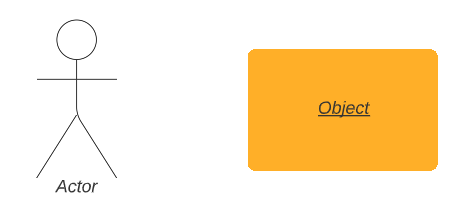

Wie im Bild oben zu sehen ist, werden Akteure immer als Strichmännchen dargestellt, während Objekte einfach rechteckig sind.

Nun können wir unsere Objekte (Geldautomat, Bankserver, Bankkonto) und unseren Akteur (Kunde) einfügen.

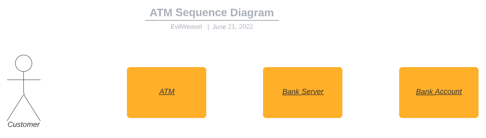

### Lebenslinien

Lebenslinien sind vertikale gestrichelte Linien, die uns die Lebensdauer unserer Objekte zeigen. Denke daran, dass in Code unsere Objekte in dieser Sequenz auch Objekte in unserer Programmiersprache sind und auch eine Lebensdauer haben. Innerhalb von Programmiersprachen, wird die Lebensdauer maßgeblich durch den Scope, indem die Variable deklariert wurde, definiert.

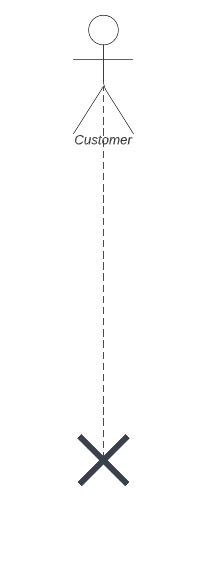

Wenn wir die Lebenslinie entlanggehen, vergeht die Zeit. Bis das Objekt/der Akteur am Ende seiner Lebensdauer ist, wo es am **X** "entsorgt" wird.

Lassen Sie uns nun die Lebenslinien aller unserer Objekte und Akteure zeichnen.

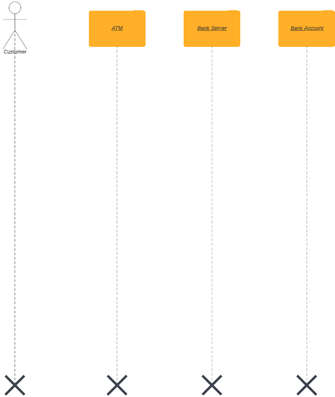

### Nachrichten

Was ist das Erste, das unsere Kunden tun müssen, um den Geldautomaten zu benutzen?

Sie müssen ihre Karte einstecken. Das wird unsere erste Nachricht sein.

Eine Nachricht ist eine Möglichkeit für uns, die zwischen Objekten gesendeten Informationen anzuzeigen. Das Sequenzdiagramm zeigt uns dann die Reihenfolge, in der diese Nachrichten gesendet werden müssen.

Nachrichten werden einfach mit Pfeilen mit Text dargestellt, der entweder die Nachricht beschreibt ("Karte überprüfen") oder Funktionen aufruft ("verifyCard()").

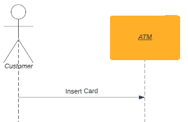

Als nächstes muss der Bankserver die Informationen auf der Kundenkarte überprüfen.

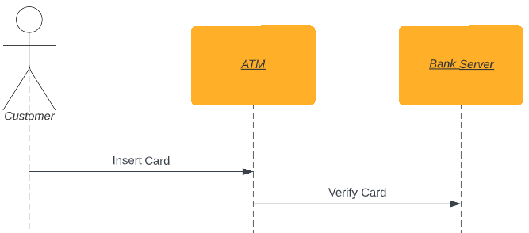

Also fragt der Geldautomat jetzt den Bankserver nach der Überprüfung der Karte.
Aber wie weiß der Geldautomat, dass die Informationen überprüft wurden?

### Rückkehrnachrichten

OK, offensichtlich benötigen wir eine Antwort vom Bankserver zurück an den Geldautomaten. Rückkehrnachrichten in einem Sequenzdiagramm werden durch die Verwendung derselben Pfeile dargestellt, jedoch mit einer gestrichelten Linie.

Für dieses Beispiel werden wir einfach "Karte OK" zurückgeben. Dies entspricht dem "Return-Value" einer Funktion/Methode.

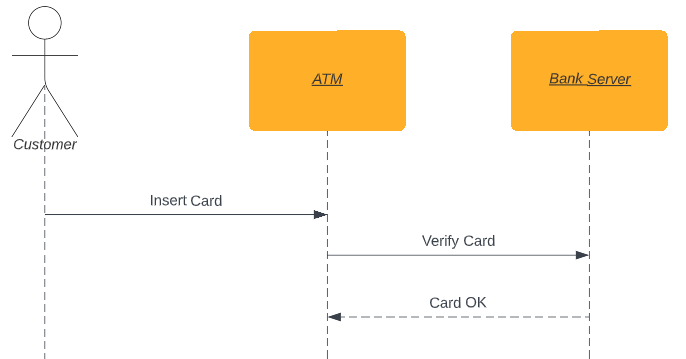

Nachdem das erledigt ist, sollte der Geldautomat den Kunden nach einer PIN-Nummer fragen, die der Kunde eingeben muss, bevor der Geldautomat das entsprechende Bankkonto öffnen kann.

Beachte: Die Nachricht, in der der Kunde aufgefordert wird, eine PIN bereitzustellen, ist keine Antwort auf die Nachricht "Karte einstecken". Die Anfrage nach der PIN selbst fragt nach Informationen, anstatt sie zu liefern.

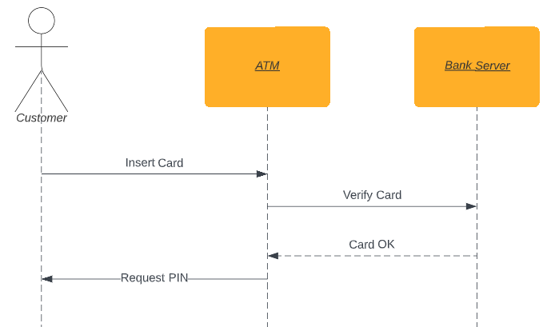

Aber jetzt haben wir ein weiteres Problem, denn es gibt mehrere verschiedene Ergebnisse für diese PIN-Anfrage. Also... wie gehen wir mit mehreren möglichen Ergebnissen um? Und was ist, wenn die Karte nicht gültig ist?

### Alternative Rahmen

Ein alternativer Rahmen in Sequenzdiagrammen wird verwendet, um eine Auswahl zwischen zwei oder mehr Nachrichtenabfolgen zu symbolisieren.
Beim Verwenden von alternativen Rahmen beachte, dass sie normalerweise gegenseitig ausschließend sind, das heißt, nur eine dieser Nachrichtenabfolgen wird verwendet.

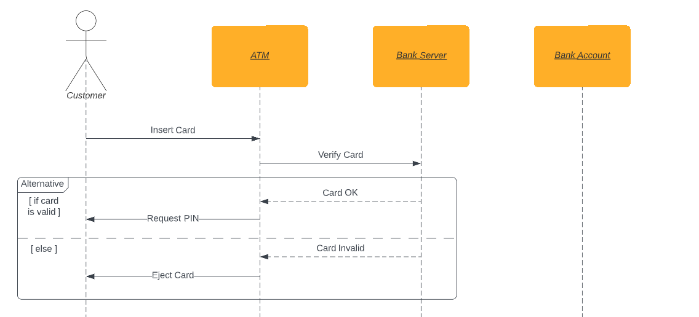

Nun zum Eingeben der PIN durch den Kunden:

Beachte, dass der Geldautomat den Kunden zuerst aufgefordert hat, die PIN einzugeben.
Diese PIN, diese Information, die wir zurücksenden, ist also eine Rückkehrnachricht.

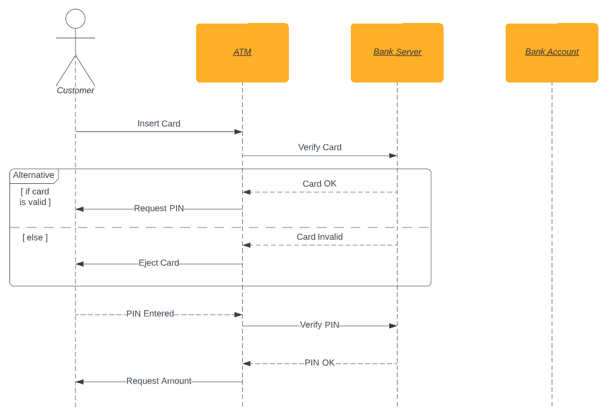

Das ist sehr ähnlich ist zu dem, was wir zuvor für die Karte getan haben.

Da die Nachricht "PIN überprüfen" wiederum in eine Nachricht "PIN ungültig" resultieren kann, zeichnen wir erneut eine Alternative, wie wir es zuvor getan haben.

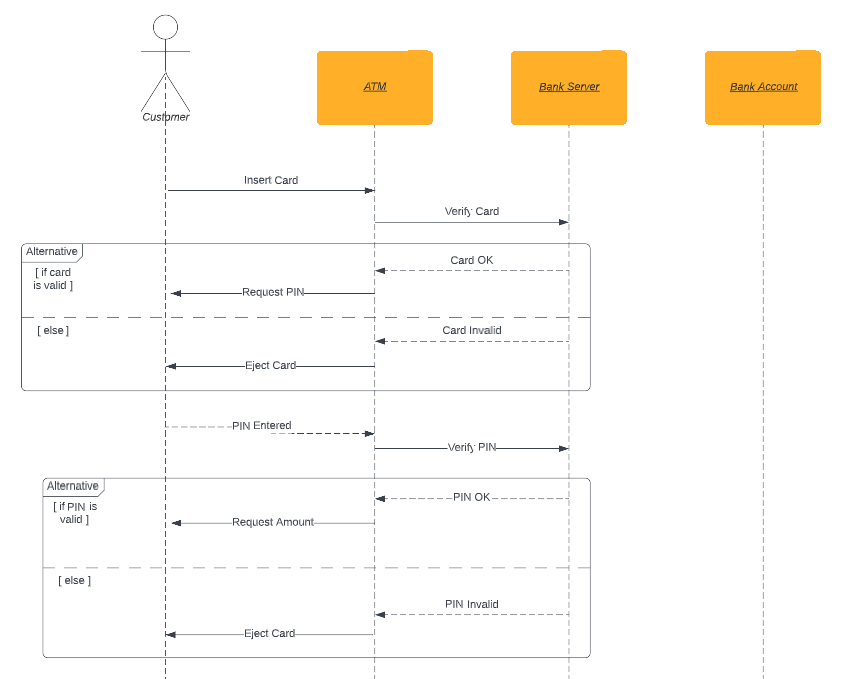

Mit dem, was wir jetzt wissen, können wir die Sequenz tatsächlich vervollständigen. Versuche es vielleicht selbst, bevor du dir das fertige Ergebnis anschaust.

### Aktivierungsfelder

Oh, noch eine kleine Sache...

Um auf einen Blick zu sehen, wie lange die Lebensdauer unserer Objekte ist, verwenden wir Aktivierungsfelder.
Sie zeigen uns, wie lange ein Objekt einen Prozess durchführt oder anders gesagt, wann sie aktiv sind und wann sie inaktiv sind.

## Lösung für unser kleines Beispiel

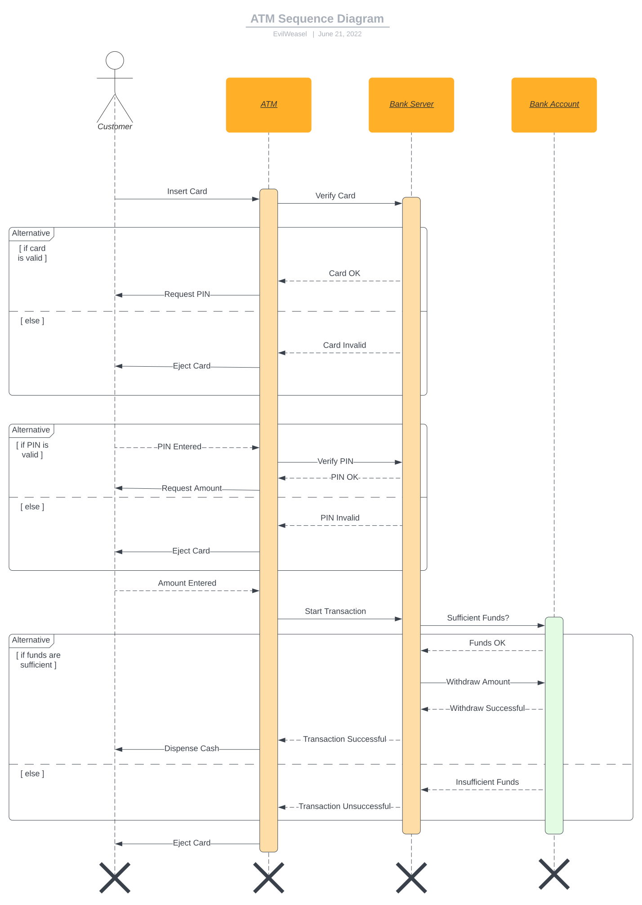