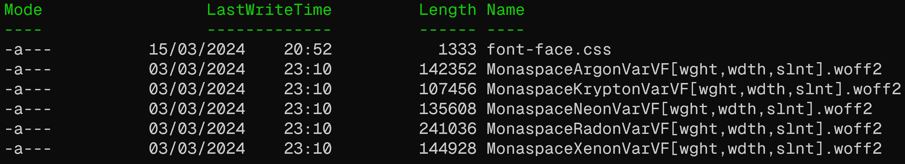

Die wohl einfachste Möglichkeit eine etwas spannendere Schriftart auf der eigenen Webseite einzubinden ist über den Google Fonts Service. Über diesen Service können wir eine oder mehrere Schriftarten, inklusive aller Schriftstärken und -styles, über ein HTML-Link-Tag auf unsere Webseite bringen.

Das nutzen des Google-Font Services hat jedoch auch einige Nachteile:

- Jeder Seitenaufruf auf unserer Website **leitet den User auf die Google-Fonts Seite weiter**, um die Fonts runterzuladen.
- Dadurch **bekommt Google die IP-Adresse** und andere Daten **des Users**.
- Wenn wir den User nicht angemessen über diesen Aufruf informieren, oder ihm die Wahl diesen Service zu nutzen, stellt dies ein **rechtliches Problem** dar.
- Außerdem sind wir nun in einer **Abhängigkeitsbeziehung mit Google**
- s. https://killedbygoogle.com/

Dabei ist das *selbst-bereitstellen von Schriftarten* ähnlich simpel wie die Bereitstellung über Google Fonts. Jedoch müssen wir dafür ein paar Dinge über Webfonts lernen. Los Geht’s!

## Arten von Fonts

Jeder kennt und liebt sie. **Statische Fonts**.
Eine statische Font wird in mehreren Dateien ausgeliefert. Jede der Dateien enthält einen spezifischen Style und Schriftstärke. Die Schriftstärken werden idR. von 100-900 deklariert. Hier eine Übersicht:

| Font-Weight | Bedeutung   |
| ----------- | ----------- |
| 100         | Thin        |
| 200         | Extra Light |
| 300         | Light       |
| 400         | Normal      |
| 500         | Medium      |
| 600         | Semi-Bold   |
| 700         | Bold        |
| 800         | Extra-Bold  |
| 900         | Black       |

Wenn wir also eine Font mit allen Stärken in einem Style haben wollen, dann brauchen wir also 9 Font-Dateien. Nehmen wir als Beispiel die **Roboto** Font.


Hier sehen wir die Lizenz der Font, welche wir natürlich im Voraus prüfen sollten.

Außerdem haben wir für jedes Gewicht und jeden Style (Normal und *Italics*) hier jeweils eine Datei. Wir haben hier die Font-Weights 100, 300, 400, 500, 700, 900

### Statische Font einbinden

Zuerst müssen wir die Font innerhalb unseres Web-Projekts abspeichern. Für dieses Beispiel machen wir das in `/assets/fonts`.

```shell
$ tree assets/
assets/
|-- background-mobile.jpg
|-- background-old.jpg
|-- background.jpg
|-- favicon.ico
L-- fonts
    |-- Matrix-MZ4P.ttf
    |-- Roboto-Black.ttf
    |-- Roboto-BlackItalic.ttf
    |-- Roboto-Bold.ttf
    |-- Roboto-BoldItalic.ttf
    |-- Roboto-Italic.ttf
    |-- Roboto-Light.ttf
    |-- Roboto-LightItalic.ttf
    |-- Roboto-Medium.ttf
    |-- Roboto-MediumItalic.ttf
    |-- Roboto-Regular.ttf
    |-- Roboto-Thin.ttf
    L-- Roboto-ThinItalic.ttf

2 directories, 17 files
```

Anschließend brauchen wir eine CSS-Datei, in der wir die Fonts definieren. Dafür erstellen wir eine `fontfaces.css` Datei, welche wir in unsere HTML-Seite mit einbinden.

Wir müssen bei einer statischen Font tatsächlich für jede Kombination aus Gewicht und Style eine eigene Font-Face Deklaration vornehmen.

```css
/* Roboto: 100,300,400,500,700,900 Normal/Italics */
@font-face {
    font-family: Roboto;
    src: url("./assets/fonts/Roboto-Thin.ttf");
    font-weight: 100;
    font-style: normal;
}
@font-face {
    font-family: Roboto;
    src: url("./assets/fonts/Roboto-ThinItalic.ttf");
    font-weight: 100;
    font-style: italic;
}
@font-face {
    font-family: Roboto;
    src: url("./assets/fonts/Roboto-Light.ttf");
    font-weight: 300;
    font-style: normal;
}
@font-face {
    font-family: Roboto;
    src: url("./assets/fonts/Roboto-LightItalic.ttf");
    font-weight: 300;
    font-style: italic;
}
@font-face {
    font-family: Roboto;
    src: url("./assets/fonts/Roboto-Regular.ttf");
    font-weight: 400;
    font-style: normal;
}
@font-face {
    font-family: Roboto;
    src: url("./assets/fonts/Roboto-Italic.ttf");
    font-weight: 400;
    font-style: italic;
}
@font-face {
    font-family: Roboto;
    src: url("./assets/fonts/Roboto-Medium.ttf");
    font-weight: 500;
    font-style: normal;
}
@font-face {
    font-family: Roboto;
    src: url("./assets/fonts/Roboto-MediumItalic.ttf");
    font-weight: 500;
    font-style: italic;
}
@font-face {
    font-family: Roboto;
    src: url("./assets/fonts/Roboto-Bold.ttf");
    font-weight: 700;
    font-style: normal;
}
@font-face {
    font-family: Roboto;
    src: url("./assets/fonts/Roboto-BoldItalic.ttf");
    font-weight: 700;
    font-style: italic;
}
@font-face {
    font-family: Roboto;
    src: url("./assets/fonts/Roboto-Black.ttf");
    font-weight: 900;
    font-style: normal;
}
@font-face {
    font-family: Roboto;
    src: url("./assets/fonts/Roboto-BlackItalic.ttf");
    font-weight: 900;
    font-style: italic;
}
```

Die Verwendung der Font ist dann wie gewohnt:

```css
body {
  font-family: Roboto, sans, sans-serif;
}
```

### Variable Fonts einbinden

Variable Fonts haben einige Vorteile gegenüber klassischen, statischen Fonts. Wir haben für jede Font-Family nur noch eine Datei. Heißt auch: Nur eine Font-Face Deklaration.

Zusätzlich können variable Fonts beliebig viele und auch eigene Parameter für Styling nutzen. In diesem Beispiel zeige ich die Github Monaspace Fonts und deren Anwendung. Die Fonts müssen sich wie gewohnt in einem Unterordner `fonts` innerhalb unseres Projekts befinden. Zusätzlich brauchen wir auch eine `font-face.css` Datei, in der wir die Font-Face Deklarationen vornehmen.



Da alle Informationen und Transformationen der Font in einer Datei vorhanden sind, brauchen wir für jede variable Font lediglich eine Font-Face Deklaration. Dafür müssen wir hier alle Parameter, welche die Font unterstützt vom niedrigsten zum höchsten Wert angeben. Damit definieren wir die möglichen Werte für jede Eigenschaft. Diese Information bekommt man vom Ersteller der Font oder einem Typografie-Programm, mit dem man Fonts bearbeiten kann. 

Die Werte für die Github-Monaspace-Fonts lassen sich von der offiziellen Webseite ablesen. Dort kann man mit den Slidern die Werte auch Testen:


Diese Werte müssen wir dann im CSS deklarieren.

```css
@font-face {
  font-family: "MonaspaceArgonVar";
  src: url("./MonaspaceArgonVarVF[wght,wdth,slnt].woff2") format("woff2");
  font-weight: 200 800;
  font-stretch: 100 125;
  font-size: 10px 48px;
  font-style: oblique -11deg 0deg;
  font-display: swap;
}
```

Anschließend können wir die variable Font verwenden. Wie Eingangs beschrieben, können wir stufenlos zwischen diesen Werten animieren und Transformationen an der Schrift vornehmen. Hier ein Beispiel für einen Link-OnHover-Effekt, welcher mit einer statischen Font zwar möglich ist, aber nicht so schön animiert.

```css
nav ul li a {
  font-family: MonaspaceArgonVar;
  color: rgb(160, 160, 160);
  text-decoration: none;
  /* padding prevents layout shift when widening the font */
  padding: 0 3px;
  font-variation-settings: "wght" 400, "wdth" 100, "slnt" 0;
  transition: all 0.5s ease-in-out;
}
nav ul li a:hover {
  color: magenta;
  text-shadow: 1px 1px 2px whitesmoke;
  font-variation-settings: "wght" 500, "wdth" 105, "slnt" -11;
  padding: 0;
}
```

Hier das Ergebnis unserer Arbeit:

import demoVF from "../assets/demo-variable-fonts.mp4";

<video src={demoVF} alt="Variable font demo with nav-links" controls></video>
