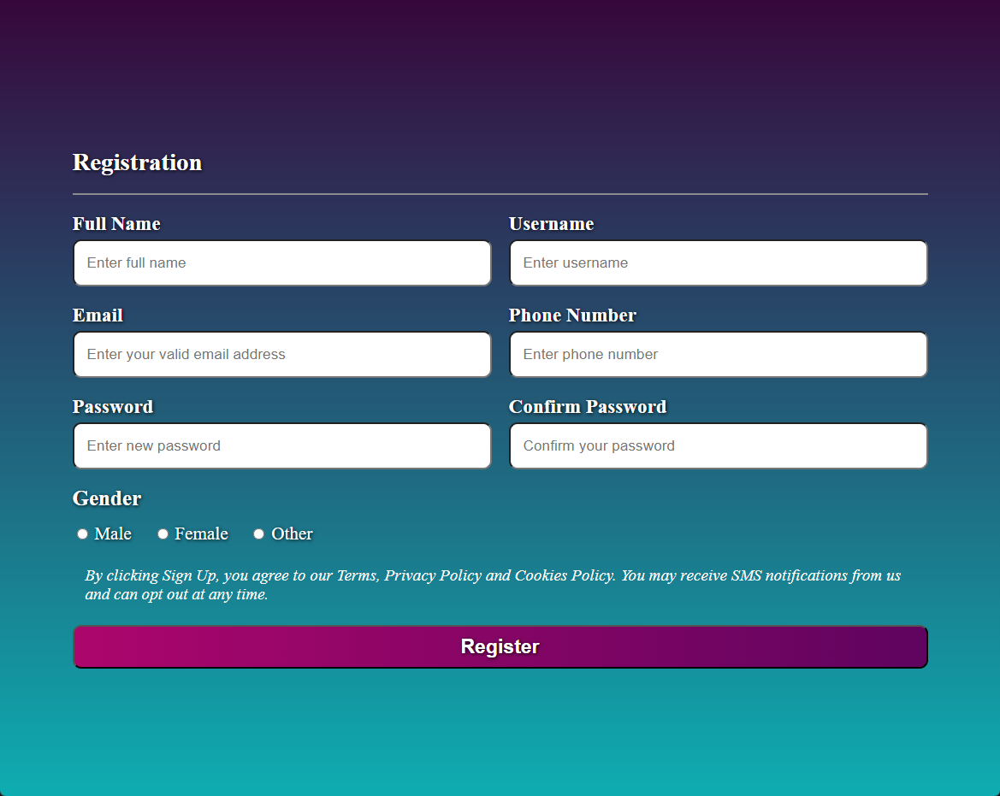

Mit dem HTML `<form>` Element können wir dem User *interaktive Steuerelemente* anbieten, um **Informationen zu senden**. Diese Informationen werden in der Regel an einen Server (API) zur Verarbeitung geschickt. 

## Minimales Beispiel: Login

```html
<form action="/result" method="post">
  <label for="username">Username</label>
  <input type="text" name="username" id="username" />
  <!-- br => Zeilenumbruch; labels und inputs sind inline-elemente -->
  <br>
  <label for="username">Username</label>
  <input type="text" name="username" id="username" />
  <br>
  <input type="submit" value="Submit" />
</form>
```

Natürlich, hier ist die Tabelle mit den Elementen/Attributen und ihren Erläuterungen:

| Element/Attribut      | Erläuterung                                                                                                                                                                                          |
| --------------------- | ---------------------------------------------------------------------------------------------------------------------------------------------------------------------------------------------------- |
| Form `action`         | Die URL, wohin das Formular übertragen wird. In diesem Fall `<hostname>/result`.                                                                                                                     |
| Form `method`         | Die HTTP-Methode zur Übertragung. Mögliche Werte sind `GET`, `POST`, `DIALOG`. In der Regel wird hier `POST` gewählt, da **`GET` Requests keinen Body** haben => **GET überträgt Daten in der URL!** |
| Label `for`           | Die ID des zugehörigen `Input` Elements. Wichtig für Accessibility. **Klick auf Label highlightet das zugehörige Input Element.**                                                                    |
| Input `type`          | Art des Inputs z.B. `text`, `email`, `password`, `date`, `time` und [viele mehr](https://developer.mozilla.org/en-US/docs/Web/HTML/Element/input).                                                   |
| Input `name`          | Bezeichner der Variable, in welcher der Input-Wert abgespeichert wird. **Ohne Bezeichner kann der Input nicht ausgewertet werden.**                                                                  |
| Input `id`            | Die ID des Input-Elements. Verbindet das Input-Element **mit dem entsprechenden Label**.                                                                                                             |
| Input `type="submit"` | Button, welcher das Formular abschickt. Das `value` Attribut diktiert den Text des Buttons.                                                                                                          |

## Formular mit Grid-Layout

Das folgende Beispiel hat einige mehr Inputs, mehr Attribute und ein wesentlich ansprechenderes Design.

**formgrid.html**
```html
<form action="/formresult" method="get">
  <h2>Registration</h2>
  <div class="formgroup">
    <label for="fullname">Full Name</label>
    <input
      type="text"
      name="fullname"
      id="fullname"
      placeholder="Enter full name"
    />
  </div>
  <div class="formgroup">
    <label for="username">Username</label>
    <input
      type="text"
      name="username"
      id="username"
      placeholder="Enter username"
    />
  </div>
  <div class="formgroup">
    <label for="email">Email</label>
    <input
      type="email"
      name="email"
      id="email"
      placeholder="Enter your valid email address"
    />
  </div>
  <div class="formgroup">
    <label for="phone">Phone Number</label>
    <input
      type="tel"
      name="phone"
      id="phone"
      placeholder="Enter phone number"
    />
  </div>
  <div class="formgroup">
    <label for="password">Password</label>
    <input
      type="password"
      name="password"
      id="password"
      placeholder="Enter new password"
    />
  </div>
  <div class="formgroup">
    <label for="confirmpass">Confirm Password</label>
    <input
      type="password"
      name="confirmpass"
      id="confirmpass"
      placeholder="Confirm your password"
    />
  </div>
  <div class="radiogroup">
    <div id="gender-title">Gender</div>
    <input type="radio" name="gender" id="male" value="male" />
    <label for="male">Male</label>
    <input type="radio" name="gender" id="female" value="female" />
    <label for="female">Female</label>
    <input type="radio" name="gender" id="other" value="other" />
    <label for="other">Other</label>
  </div>
  <p>
    By clicking Sign Up, you agree to our Terms, Privacy Policy and Cookies
    Policy. You may receive SMS notifications from us and can opt out at any
    time.
  </p>
  <input type="submit" value="Register" />
</form>
```

**formgrid.css**
```css
<style>
  :root {
    --text-shadow: 1px 1px 4px black;
  }
  body {
    background: linear-gradient(
      180deg,
      rgba(55, 7, 59, 1) 0%,
      rgba(14, 173, 177, 1) 100%
    );
    background-repeat: no-repeat;
    min-height: 100vh;
    margin: 0;
    padding: 0;
    color: #fefefe;
    display: flex;
    flex-direction: column;
    align-items: center;
    justify-content: center;
  }
  form {
    display: grid;
    min-width: 650px;
    max-width: 1000px;
    grid-template-columns: 1fr 1fr;
    font-size: 1.2rem;
    gap: 20px;
    margin: 40px;
  }
  form > h2 {
    grid-column: span 2;
    text-shadow: var(--text-shadow);
    border-bottom: 2px solid #8c8c8c;
    padding-bottom: 20px;
    margin-bottom: 0;
  }
  form > p {
    grid-column: span 2;
    margin: 5px 15px;
    font-style: italic;
  }
  form > input[type="submit"] {
    grid-column: span 2;
    padding: 10px;
    font-size: 1.2em;
    font-weight: 600;
    border-radius: 10px;
    color: white;
    background: linear-gradient(
      to right,
      rgb(172, 6, 108) 0%,
      rgb(95, 4, 95) 100%
    );
    text-shadow: var(--text-shadow);
  }
  form > .formgroup {
    display: flex;
    flex-direction: column;
    gap: 5px;
  }
  form > .formgroup > label {
    font-size: 1.2em;
    font-weight: 600;
    text-shadow: var(--text-shadow);
  }
  form > .formgroup > input {
    font-size: 0.9em;
    padding: 15px;
    border-radius: 10px;
  }
  .radiogroup {
    grid-column: span 2;
  }
  .radiogroup > #gender-title {
    font-size: 1.3em;
    font-weight: 600;
    margin-bottom: 15px;
    text-shadow: var(--text-shadow);
  }
  .radiogroup > label {
    margin-right: 20px;
    font-size: 1.1em;
    text-shadow: var(--text-shadow);
  }
  @media only screen and (max-width: 650px) {
    form {
      grid-template-columns: 1fr;
      min-width: fit-content;
      margin: 20px;
    }
    form > h2,
    .radiogroup,
    form > input[type="submit"],
    form > p {
      grid-column: auto;
    }
  }
</style>
```

### Ergebnis


