import { LinkCard } from '@astrojs/starlight/components'

<LinkCard title="Microsoft Learn | MS-900 Examen" href="https://learn.microsoft.com/de-de/credentials/certifications/exams/ms-900/" target="_blank" />

## Fotostrecke - Anmeldung zur Prüfung

Die Online-Prüfung wird von **PearsonVUE** abgenommen.

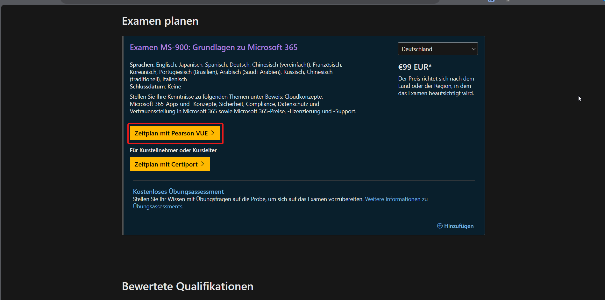

### Prüfen der persönlichen Daten

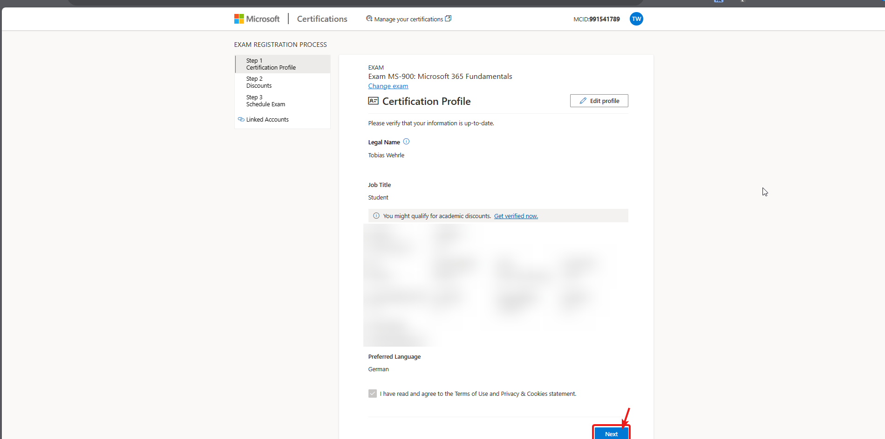

### Discounts

Achtung: Die Eingabe unseres **Gutscheins erfolgt erst am Ende des Prozesses**, da dieser die Rechnung bei **PearsonVUE** begleicht, und nicht Microsoft. Einfach weiter, hier entstehen keine Kosten für euch.

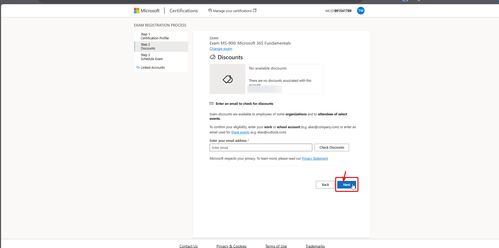

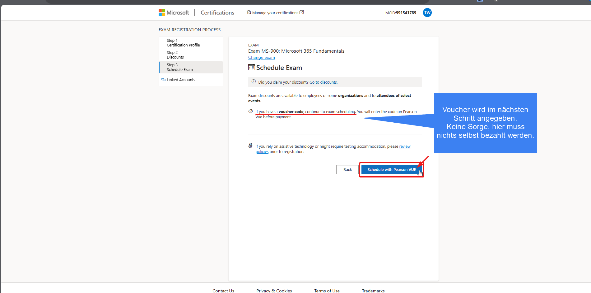

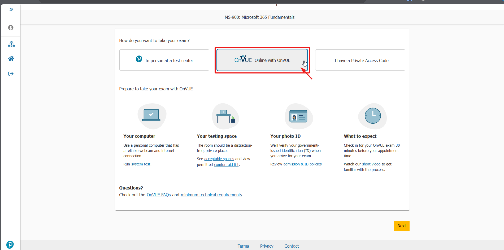

### Auswahl der Prüfungssprache

Sprachauswahl basierend auf persönlicher Präferenz. Für mich: `Englisch`

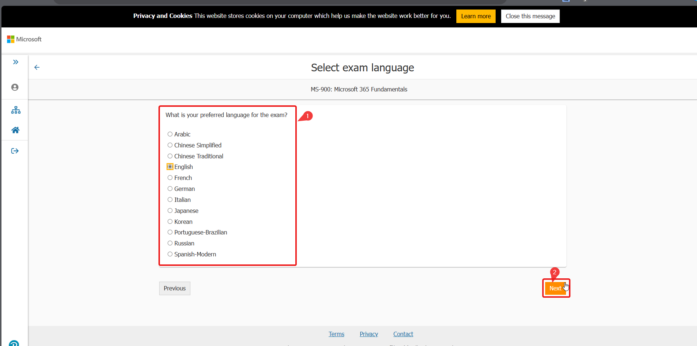

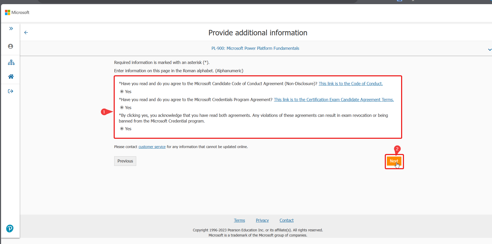

### Akzeptieren der AGB

Hier wird man aufgefordert der AGB zuzustimmen. Spielt sich wie Duck-Hunt, aber mit *Checkboxen*. Einfach durchlesen und vor allem die Regeln zum Prüfungstag beachten.

### Sprachauswahl für Prüfer und Support

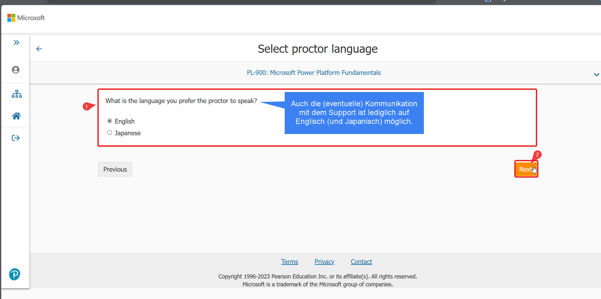

### Prüfungstermin festlegen

Falls du die Prüfung bei uns vor Ort absolvieren möchtest, stelle bitte vor der Buchung sicher, dass zu dem Termin ein passender Raum frei ist.

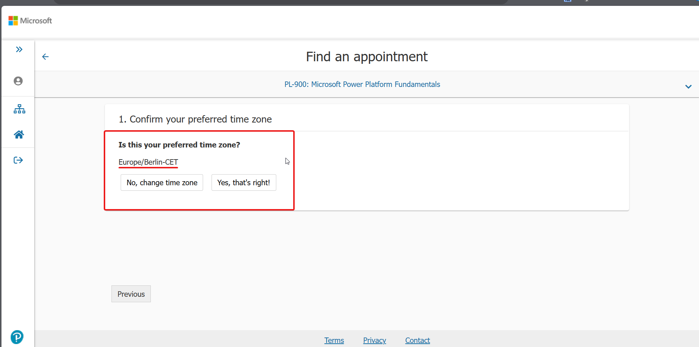

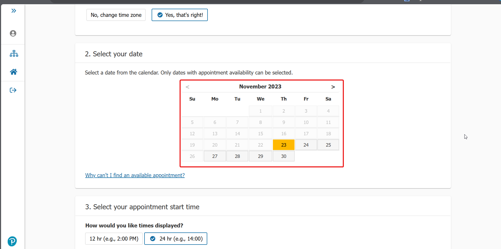

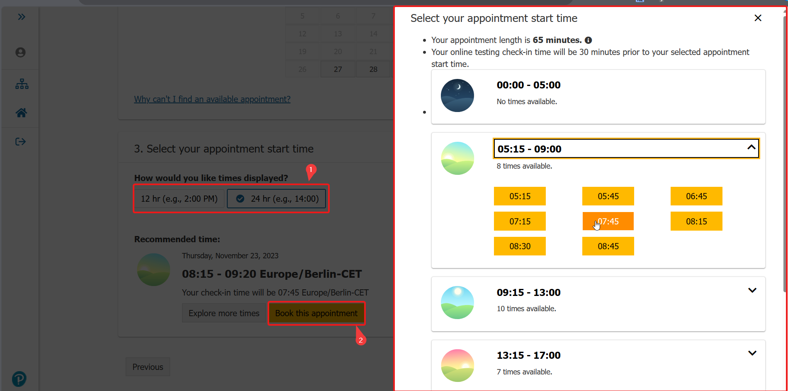

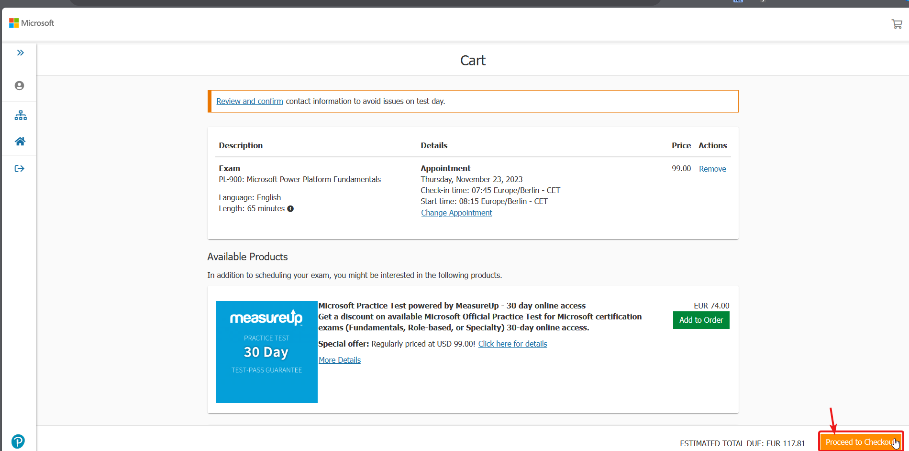

### Den Gutschein eingeben

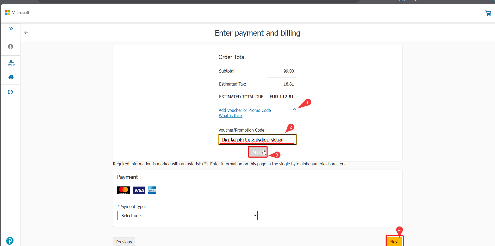

Die restlichen Schritte erklären sich dann von selbst.

## Und dann?

### Kursleitfaden

Hier stehen allgemeine Infos zum Zertifikat.

[Kursleitfaden für das Examen MS-900: Microsoft 365-Grundlagen](https://learn.microsoft.com/de-de/credentials/certifications/resources/study-guides/ms-900)

### Übungs-Prüfung

Simulation der Prüfungsfragen. Leider nur auf `Englisch` verfügbar.

[Practice Assessment](https://learn.microsoft.com/en-us/credentials/certifications/exams/ms-900/practice/assessment?assessment-type=practice&assessmentId=50)

### Bin ich bereit für die Prüfung?

Die Prüfung wird von `OnVue` abgenommen. Der Ablauf und eine Check-Liste sind auf der Website verfügbar.

Zumindest sollte man vorher einen System-Check machen. Dort wird das Programm, welches Täuschungsversuche verhindern soll, getestet. Falls hier was nicht funktioniert am Prüfungstag, wird der Versuch als gescheitert angesehen.

Wichtig dabei: Schließe alle offenen Programme und Hintergrundprozesse, welche nicht zur Standardsoftware von Windows gehören. Bedeutet: `OneDrive` ist kein Problem, Webbrowser oder Services wie `AnyDesk` müssen geschlossen sein!

Mehr Informationen zum Ablauf der Prüfung und der System-Check finden sich auf der Website von [PearsonVUE](https://home.pearsonvue.com/Clients/Microsoft/Online-proctored.aspx).
